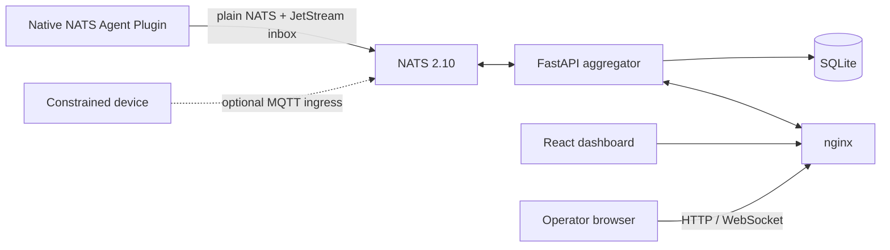

# EdgeCitadel

EdgeCitadel is a small control plane for running and observing AI agents on edge
hosts. NATS carries fleet traffic, the FastAPI aggregator stores the dashboard
view in SQLite, and the React dashboard exposes the operator interface.

The maintained transport is native NATS. MQTT ingress is an optional deployment
adapter for constrained devices and is disabled by default.

## What is included

- A NATS 2.10 server with JetStream-backed per-agent inboxes.
- A FastAPI aggregator with SQLite persistence, REST APIs, and dashboard WebSocket updates.
- A React/Vite dashboard served through nginx.
- Supervisor-managed Agent Plugins under `plugins/`.
- Playwright end-to-end tests for operator workflows.

The canonical wire contract is [`schemas/envelope.v1.json`](schemas/envelope.v1.json).

## Requirements

| Host capability | Core | `single-client` Edge | `nats_leaf` Edge |
|---|---:|---:|---:|
| macOS or Linux | Yes | Yes | Yes |
| Python 3.12+ for pip install | Yes | Yes | Yes |
| Docker Desktop/Engine with Compose | Required | No | No |
| `nats-server` executable | Optional | No | Required |

Homebrew installs `nats-server` automatically. pip and source installations
leave this native service to the operating-system package manager; verify it
with `nats-server --version` before selecting `nats_leaf`. Core hosts expose
ports 80, 4222, 7422, and 8222 to the networks that need them.

On macOS, a pip user can install only that native dependency with
`brew install nats-server`. On Linux, use the distribution package or an
official NATS release.

## Install

EdgeCitadel provides one `edgecitadel` command for Core and Edge hosts. Public
Homebrew and PyPI releases are not published yet, so use the source-build pip
flow for the current revision.

### pip from this checkout (available now)

```bash
git clone https://github.com/zhonghaozhan/EdgeCitadel.git
cd EdgeCitadel
python3 -m venv ~/.edgecitadel/cli-venv
~/.edgecitadel/cli-venv/bin/python -m pip install .
source ~/.edgecitadel/cli-venv/bin/activate
edgecitadel --version
```

The wheel is self-contained: Core Compose sources, schemas, the Supervisor, and
bundled Plugins are installed under the Python environment's
`share/edgecitadel`. The checkout is not needed after installation.

### Published package commands (after release)

```bash
# pip
python3 -m venv ~/.edgecitadel/cli-venv
~/.edgecitadel/cli-venv/bin/python -m pip install edgecitadel

# Homebrew
brew tap zhonghaozhan/edgecitadel
brew install edgecitadel
```

Do not use the short package names until the corresponding release is actually
published. See [`deploy/pip/README.md`](deploy/pip/README.md) and
[`deploy/homebrew/README.md`](deploy/homebrew/README.md) for package build and
release verification.

### Run directly from a checkout

Contributors can skip package installation and replace `edgecitadel` in the
examples below with `./scripts/edgecitadel`.

## Create a Core

A Core requires Docker and available ports 80, 4222, 7422, and 8222.

```bash
edgecitadel create --host core.example.internal
edgecitadel doctor
```

`create` generates local credentials, renders NATS configuration, starts the
Compose stack, and waits for NATS, JetStream, and the API. It is idempotent and
preserves existing secrets. Open <http://localhost> for the dashboard and stop
the Core without deleting data with:

```bash
edgecitadel down
```

## Join an Edge

On the Core, create a short-lived, single-use invitation. `--host` must be a
hostname or IP reachable from the Edge:

```bash
edgecitadel invite --node-id studio-macmini --host core.example.internal
```

On the Edge, install EdgeCitadel using either method above, then choose exactly
one messaging mode during the first join:

```bash
# Default: Plugins connect directly to Core NATS; no local NATS process.
edgecitadel join 'ecjoin://...' --messaging-mode single-client

# Local broker: same-host agents keep communicating while Core is unavailable.
edgecitadel join 'ecjoin://...' --messaging-mode nats_leaf
```

`single-client` is the backward-compatible default, so omitting
`--messaging-mode` selects it. `nats_leaf` starts a loopback-only local
NATS/JetStream service and connects outbound to Core port 7422. During a Core
outage, same-host messaging continues while cross-node messaging pauses. A host
cannot silently change modes by rerunning `join`.

## Install and operate Plugins

Install a bundled Plugin by name or provide a package directory:

```bash
edgecitadel plugin install echo
edgecitadel plugin install ./path/to/plugin
edgecitadel plugin list
edgecitadel plugin logs example.echo
```

The first Plugin command creates a private Supervisor environment. Installation
validates the package lock and schema without executing Plugin code, displays
requested permissions, copies an immutable package, starts the runtime, and
waits for its Agent Card and heartbeat. Runtime-specific credentials remain the
Plugin's responsibility.

Useful lifecycle checks are:

```bash
edgecitadel status
edgecitadel doctor
edgecitadel supervisor status
edgecitadel messaging status  # nats_leaf Edge only
```

## Upgrade and uninstall

Package upgrades preserve credentials, plugins, logs, SQLite, and JetStream
under `~/.edgecitadel`:

```bash
# Current checkout build
~/.edgecitadel/cli-venv/bin/python -m pip install --upgrade /absolute/path/to/EdgeCitadel

# Published package, after release
~/.edgecitadel/cli-venv/bin/python -m pip install --upgrade edgecitadel
```

Before uninstalling a `nats_leaf` Edge, stop its managed processes:

```bash
~/.edgecitadel/cli-venv/bin/edgecitadel supervisor stop
~/.edgecitadel/cli-venv/bin/edgecitadel messaging stop
~/.edgecitadel/cli-venv/bin/python -m pip uninstall edgecitadel
```

If EdgeCitadel was installed with `pipx`, run the same stop commands through
the `edgecitadel` executable exposed by `pipx`, then run
`pipx uninstall edgecitadel`. For Homebrew, run the stop commands through its
`edgecitadel` executable, then run `brew uninstall edgecitadel`.

Uninstalling the package intentionally preserves `~/.edgecitadel`; remove that
state only after backing it up and verifying the exact path. See
[`docs/onboarding.md`](docs/onboarding.md) for delivery semantics, security
boundaries, troubleshooting, and recovery details.

## Architecture



| Port | Owner | Purpose |
|---|---|---|
| 80 | nginx | Dashboard, `/api/*`, and `/ws/*` |
| 4222 | NATS | Native agent and service connections |
| 7422 | NATS | Authenticated inbound Leaf connections from Edge nodes |
| 8222 | NATS | Monitoring and health endpoints |
| 1883 | NATS | Optional MQTT ingress; disabled by default |

Only `agents.{id}.inbox` is a durable work queue. Registration, heartbeat,
status, logs, progress, outbox audit mirrors, and broadcasts use plain NATS.
Each inbox subject has exactly one JetStream owner: Core for Core and
`single-client` agents, or the destination Edge domain for `nats_leaf` agents.
See [`docs/architecture/multi-mode-messaging.md`](docs/architecture/multi-mode-messaging.md)
for delivery, outage, deduplication, and security semantics.

## Repository map

| Path | Responsibility |
|---|---|
| `aggregator/` | FastAPI backend, NATS subscriptions, and SQLite persistence |
| `frontend/` | The only dashboard source tree |
| `plugins/` | Installable Agent Plugin packages and runtime implementations |
| `plugin-toolkit/` | Shared Plugin runtime, validation Supervisor, schemas, and tests |
| `nats/`, `nginx/` | Local stack configuration |
| `deploy/` | Host installation and service management |
| `e2e/` | Playwright operator-flow tests |

## Development

```bash
# Backend
cd aggregator
uv run --isolated --with-requirements requirements-dev.txt python -m pytest -q

# Repository Python lint, CLI tests, and maintained strict type scopes are
# defined in .agents/skills/commit-check/SKILL.md.

# Frontend
cd ../frontend
npm ci && npm run lint && npm run build

# Deterministic end to end (owns a disposable test stack)
cd ../e2e
npm ci && npm test

# External Plugin E2E requires a separately prepared stack and Plugin services.
APP_URL=http://localhost AGG_URL=http://localhost:8000 npm run test:external-plugins
```

Repository workflow and quality gates are defined once in [`AGENTS.md`](AGENTS.md).
Tool-specific files may add integration details but do not replace those rules.
See [`CONTRIBUTING.md`](CONTRIBUTING.md) before opening a change.

## License

MIT
