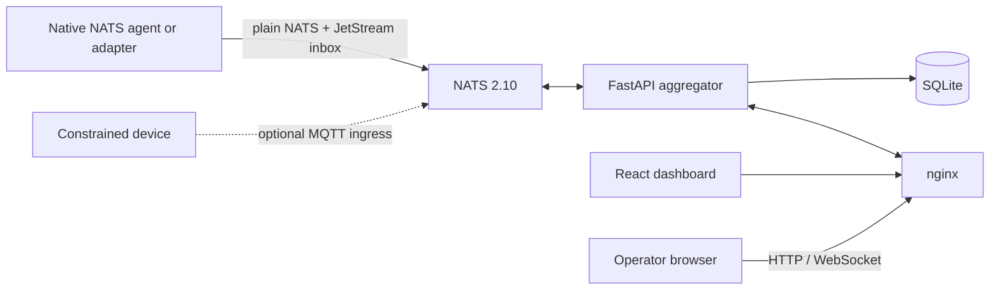

# EdgeCitadel

EdgeCitadel is a small control plane for running and observing AI agents on edge
hosts. NATS carries fleet traffic, the FastAPI aggregator stores the dashboard
view in SQLite, and the React dashboard exposes the operator interface.

The maintained transport is native NATS. MQTT ingress is an optional deployment
adapter for constrained devices and is disabled by default.

## What is included

- A NATS 2.10 server with JetStream-backed per-agent inboxes.
- A FastAPI aggregator with SQLite persistence, REST APIs, and dashboard WebSocket updates.
- A React/Vite dashboard served through nginx.
- Native adapters for supported agent runtimes under `adapters/`.
- Playwright end-to-end tests for operator workflows.

The canonical wire contract is [`schemas/envelope.v1.json`](schemas/envelope.v1.json).
Subject ownership, durability, and delivery semantics are documented in
[`docs/05-messaging.md`](docs/05-messaging.md).

## Quick start

Prerequisites are Docker Engine with Compose and available ports 80, 4222, and
8222. Port 1883 is reserved by the development stack but MQTT is off unless it
is explicitly enabled.

```bash
git clone https://github.com/zhonghaozhan/EdgeCitadel.git
cd EdgeCitadel
cp .env.example .env
# Replace the placeholder tokens in .env.
mkdir -p data nats/data
./scripts/render-nats-conf.sh
docker compose up --build -d
```

Verify the broker and application, then open <http://localhost>:

```bash
curl --fail http://localhost:8222/healthz
curl --fail http://localhost/api/system/status
```

Runtime data is written below `data/` and `nats/data/`; neither directory should
be committed. Stop the stack with `docker compose down`.

For a production host installation, follow
[`docs/02-server-setup-linux.md`](docs/02-server-setup-linux.md). Agent authors
should start with [`docs/agent-contract.md`](docs/agent-contract.md) and
[`docs/03-agent-registration.md`](docs/03-agent-registration.md), rather than the
legacy MQTT helper scripts.

## Architecture



| Port | Owner | Purpose |
|---|---|---|
| 80 | nginx | Dashboard, `/api/*`, and `/ws/*` |
| 4222 | NATS | Native agent and service connections |
| 8222 | NATS | Monitoring and health endpoints |
| 1883 | NATS | Optional MQTT ingress; disabled by default |

Only `agents.{id}.inbox` is a durable work queue. Registration, heartbeat,
status, logs, progress, outbox audit mirrors, and broadcasts use plain NATS.
See [`docs/01-architecture.md`](docs/01-architecture.md) for component ownership
and [`docs/05-messaging.md`](docs/05-messaging.md) for the complete subject list.

## Repository map

| Path | Responsibility |
|---|---|
| `aggregator/` | FastAPI backend, NATS subscriptions, and SQLite persistence |
| `frontend/` | The only dashboard source tree |
| `adapters/` | Agent runtime integrations and shared execution code |
| `nats/`, `nginx/` | Local stack configuration |
| `deploy/` | Host installation and service management |
| `e2e/` | Playwright operator-flow tests |
| `docs/` | Current architecture, contracts, setup, and operations |

## Development

```bash
# Backend
cd aggregator
ruff check . && ruff format --check . && mypy --strict . && pytest tests/ -x

# Frontend
cd ../frontend
npm ci && npm run lint && npm run build

# End to end (requires the running stack)
cd ../e2e
npm ci && npm test
```

Repository workflow and quality gates are defined once in [`AGENTS.md`](AGENTS.md).
Tool-specific files may add integration details but do not replace those rules.
See [`CONTRIBUTING.md`](CONTRIBUTING.md) before opening a change.

## Documentation

The maintained documentation index is [`docs/README.md`](docs/README.md).

## License

MIT
