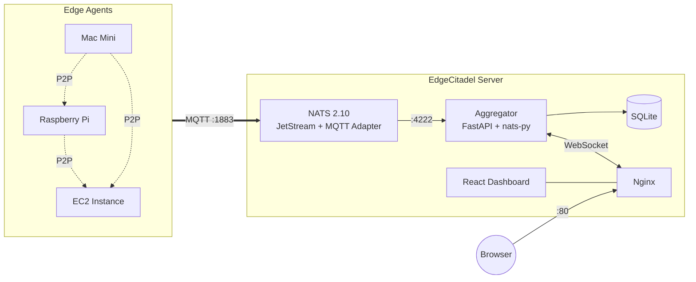
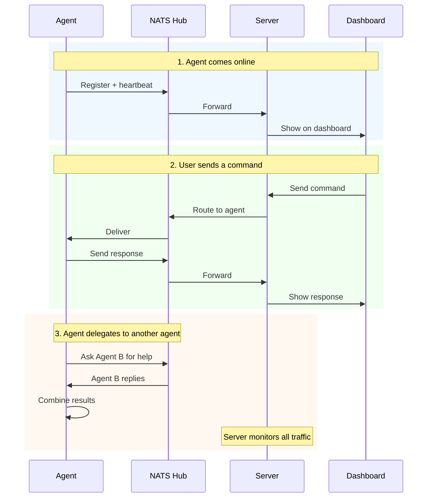

# EdgeCitadel

Monitor, command, and orchestrate AI agents across edge devices from a single dashboard. Built on NATS 2.10 with MQTT adapter for IoT, JetStream for persistence, and P2P delegation for autonomous agent collaboration.

## Demo


## Features

- **Real-Time Dashboard** — live WebSocket feed of all agent activity, system health, and connection status
- **P2P Agent Delegation** — agents delegate tasks to peers autonomously with loop detection and depth limits
- **Communication Flow Graph** — force-directed topology visualization of agent-to-agent message patterns
- **Task Board** — Kanban-style tracking (Pending → Assigned → Running → Completed/Failed) with priority levels
- **Message History** — full-text search, correlation ID grouping, and conversation replay via JetStream
- **LLM Token Streaming** — stream agent responses token-by-token through NATS subjects to the dashboard
- **Hybrid NATS + MQTT** — native NATS for the backend, built-in MQTT adapter on port 1883 for IoT agents
- **Single-Token Auth** — one `NATS_TOKEN` secures both NATS and MQTT connections

## Quick Start

```bash
git clone https://github.com/zhonghaozhan/EdgeCitadel.git && cd EdgeCitadel
cp .env.example .env              # set NATS_TOKEN and OPENCLAW_API_KEY
mkdir -p data nats/data
docker compose up --build -d
```

Verify: `curl http://localhost:8222/healthz` (NATS) and open `http://localhost` (dashboard).

## Add an Agent

**On the server:**

```bash
./add-agent.sh my-agent
```

**On the agent's machine:**

```bash
git clone https://github.com/zhonghaozhan/EdgeCitadel.git && cd EdgeCitadel
./join.sh <server-ip> <nats-token> my-agent
```

The agent auto-detects its hostname, device type, and local OpenClaw installation. It registers over MQTT and appears on the dashboard within seconds.

## Managing Agents

```bash
journalctl --user -u edgecitadel-my-agent -f        # logs
systemctl --user restart edgecitadel-my-agent        # restart
systemctl --user stop edgecitadel-my-agent           # stop
```

---

## Architecture



> P2P delegation routes through NATS — agents publish to each other's inbox topics.
> The aggregator observes all traffic (including P2P) via its `agents.>` wildcard subscription.

There is **no separate MQTT broker**. NATS 2.10 has a built-in MQTT adapter that translates MQTT topics (`agents/name/action`) to NATS subjects (`agents.name.action`) automatically.

- **IoT agents** connect via MQTT on port 1883 using `NATS_TOKEN` as password
- **Aggregator** connects via native NATS on port 4222
- **Dashboard** receives updates via WebSocket through Nginx

## Communication Flow



P2P delegation has built-in guardrails: max 3 rounds, 90s timeout, loop detection, and depth limits. See [docs/06-p2p-delegation.md](docs/06-p2p-delegation.md).

## Subjects & Topics

| MQTT Topic (agent-side) | NATS Subject (server-side) | Purpose |
|---|---|---|
| `agents/{id}/register` | `agents.{id}.register` | Agent registration |
| `agents/{id}/heartbeat` | `agents.{id}.heartbeat` | Health metrics |
| `agents/{id}/inbox` | `agents.{id}.inbox` | Commands to agent (from dashboard or P2P) |
| `agents/{id}/outbox` | `agents.{id}.outbox` | Responses from agent (+ P2P delegation requests) |
| `agents/{id}/status` | `agents.{id}.status` | Online/offline |
| `agents/{id}/log` | `agents.{id}.log` | Log entries |
| `tasks/{id}/assign` | `tasks.{id}.assign` | Task assignment |
| `tasks/{id}/complete` | `tasks.{id}.complete` | Task completion |
| `system/broadcast` | `system.broadcast` | Broadcast to all |

## Services & Ports

| Port | Protocol | Service |
|------|----------|---------|
| 80 | HTTP | Nginx (dashboard + API + WebSocket) |
| 1883 | MQTT | NATS MQTT adapter (agent connections) |
| 4222 | NATS | Native NATS (aggregator) |
| 8222 | HTTP | NATS monitoring (`/healthz`, `/varz`, `/jsz`) |

---

## Coding Agent Compatibility

This repo is structured to work with both Codex and Claude Code.

- Shared coding-agent instructions live in `AGENTS.md`.
- `CLAUDE.md` is a thin Claude compatibility wrapper that imports the shared instructions.
- Subproject-specific guidance lives in nested `AGENTS.md` files under active paths such as `aggregator/`, `frontend/`, `openclaw-client/`, and `e2e/`.
- Shared Claude project settings live in `.claude/settings.json`; local-only Claude overrides belong in `.claude/settings.local.json`.

For setup and verification details, see `docs/agent-setup.md`.

### Verification Expectations

- UI, browser-flow, and operator-workflow changes must include actual Playwright verification from `e2e/`; curl-only smoke checks are not sufficient.
- Shared workflow, repo-structure, Docker, or agent-config changes should restart the stack and then run smoke checks plus the narrowest relevant Playwright coverage.

---

## Documentation

| Topic | Link |
|-------|------|
| Architecture | [docs/01-architecture.md](docs/01-architecture.md) |
| Server Setup | [docs/02-server-setup.md](docs/02-server-setup.md) |
| Agent Registration | [docs/03-agent-registration.md](docs/03-agent-registration.md) |
| Messaging Protocol | [docs/05-messaging.md](docs/05-messaging.md) |
| P2P Delegation | [docs/06-p2p-delegation.md](docs/06-p2p-delegation.md) |
| Task Management | [docs/07-task-management.md](docs/07-task-management.md) |
| API Reference | [docs/08-api-reference.md](docs/08-api-reference.md) |
| Monitoring | [docs/09-monitoring.md](docs/09-monitoring.md) |

## Development

```bash
# Aggregator
cd aggregator && ruff check --fix && ruff format && mypy --strict && pytest tests/ -x

# Frontend
cd frontend && npm run lint && npm run build

# E2E
cd e2e && npx playwright test
```

## License

MIT
