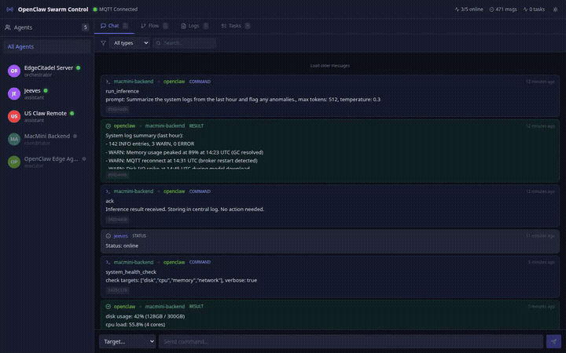

# Edge Citadel

Central aggregation hub for multiple remote [OpenClaw](https://github.com/openclaw) deployments. Connects to agents via NATS messaging, stores all traffic in SQLite, and presents a single real-time dashboard.

## Demo



> Multi-deployment agent monitoring with real-time NATS aggregation. ([Full video](docs/demo.mp4))

## Features

- **Multi-Agent Communication** -- NATS pub/sub with JetStream persistence and K/V state
- **Real-Time Dashboard** -- WebSocket-driven feed of all agent messages
- **Agent Graph** -- Force-directed visualization of agent communication topology
- **Message Composer** -- Send commands to any agent directly from the dashboard
- **LLM Token Streaming** -- Stream tokens between agents via NATS subjects
- **Session Replay** -- JetStream conversation streams with ordered consumers
- **Message Persistence** -- All episodes stored in SQLite for history queries

## Architecture

```
Mac Mini (Rupert)          Raspberry Pi (Jeeves)      EC2 (Percy)
┌───────────────────┐      ┌───────────────────┐      ┌───────────────────┐
│ ┌───────────────┐ │      │ ┌───────────────┐ │      │ ┌───────────────┐ │
│ │  NATS :4222   │◄├─────►├►│  NATS :4222   │◄├─────►├►│  NATS :4222   │ │
│ └───────┬───────┘ │      │ └───────┬───────┘ │      │ └───────┬───────┘ │
│ ┌───────▼───────┐ │      │ ┌───────▼───────┐ │      │ ┌───────▼───────┐ │
│ │ Rupert Agent  │ │      │ │ Jeeves Agent  │ │      │ │ Percy Agent   │ │
│ └───────────────┘ │      │ └───────────────┘ │      │ └───────────────┘ │
│ ┌───────────────┐ │      │                   │      │                   │
│ │ Aggregator    │ │      │                   │      │                   │
│ │ + SQLite      │ │      │                   │      │                   │
│ └───────────────┘ │      │                   │      │                   │
└───────────────────┘      └───────────────────┘      └───────────────────┘
               Tailscale encrypted overlay
```

Agents communicate via NATS subjects. The aggregator subscribes to `agents.>`, `tasks.>`, and `system.>`, stores structured records in SQLite, and streams events to the React dashboard via WebSocket.

## Tech Stack

| Layer       | Technology                                        |
| ----------- | ------------------------------------------------- |
| Messaging   | NATS 2.10 + JetStream                             |
| Aggregator  | Python 3.12, FastAPI, nats-py                      |
| Dashboard   | React 18, Vite 5, Tailwind CSS, Zustand, recharts |
| Database    | SQLite                                             |
| Proxy       | Nginx                                              |
| Infra       | Docker Compose                                     |

---

## Quick Start

### 1. Start the server

```bash
git clone https://github.com/zhonghaozhan/EdgeCitadel.git
cd EdgeCitadel
cp .env.example .env          # edit to set OPENCLAW_API_KEY
mkdir -p data nats/data
docker compose up --build -d
```

Open `http://localhost` -- the dashboard is live.

### 2. Verify NATS is running

```bash
# Check NATS health (monitoring endpoint)
curl http://localhost:8222/healthz

# Check JetStream status
docker compose exec nats nats-server --signal ldm  # or just check logs
docker compose logs nats
```

### 3. Add an agent (on the server)

```bash
./add-agent.sh my-agent-name
```

This prints a join command to run on the agent's machine.

### 4. Join from the agent's machine

```bash
git clone https://github.com/zhonghaozhan/EdgeCitadel.git
cd EdgeCitadel
./join.sh <server-ip> [agent-id]
```

The agent auto-detects its hostname, device type, and local OpenClaw installation. It appears on the dashboard within seconds.

---

## Coding Agent Compatibility

This repo is structured to work with both Codex and Claude Code.

- Shared coding-agent instructions live in `AGENTS.md`.
- `CLAUDE.md` is a thin Claude compatibility wrapper that imports the shared instructions.
- Subproject-specific guidance lives in nested `AGENTS.md` files under active paths such as `aggregator/`, `frontend/`, `openclaw-client/`, and `e2e/`.
- Shared Claude project settings live in `.claude/settings.json`; local-only Claude overrides belong in `.claude/settings.local.json`.

For setup and verification details, see `docs/agent-setup.md`.

### Verification Expectations

- UI, browser-flow, and operator-workflow changes must include actual Playwright verification from `e2e/`; curl-only smoke checks are not sufficient.
- Shared workflow, repo-structure, Docker, or agent-config changes should restart the stack and then run smoke checks plus the narrowest relevant Playwright coverage.

---

## Setup Details

### NATS Server (Broker)

The NATS server runs as a Docker container with JetStream enabled for persistent messaging.

**Docker Compose config:**
```yaml
nats:
  image: nats:2.10-alpine
  command: ["--jetstream", "--store_dir", "/data", "-p", "4222", "--http_port", "8222"]
  ports:
    - "4222:4222"   # Client connections
    - "8222:8222"   # HTTP monitoring
  volumes:
    - ./nats/data:/data
```

**Key features:**
- Port 4222: Client connections (agents + aggregator)
- Port 8222: HTTP monitoring (`/healthz`, `/varz`, `/jsz`)
- JetStream storage in `./nats/data/` for stream persistence
- No auth by default (agents on Tailscale overlay are trusted)

**Useful commands:**
```bash
# View NATS server info
curl http://localhost:8222/varz | python3 -m json.tool

# View JetStream status
curl http://localhost:8222/jsz | python3 -m json.tool

# View connected clients
curl http://localhost:8222/connz | python3 -m json.tool

# Install NATS CLI for advanced management (optional)
# brew install nats-io/nats-tools/nats   (macOS)
# go install github.com/nats-io/natscli/nats@latest   (Go)
nats server info
nats stream ls
nats sub "agents.>"    # subscribe to all agent subjects
```

### Aggregator (Python Backend)

The aggregator connects to NATS, subscribes to all agent/task/system subjects, and stores structured data in SQLite.

**Install dependencies (local development):**
```bash
cd aggregator
pip install -r requirements.txt
# requirements.txt includes: fastapi, uvicorn, nats-py, pydantic
```

**Run locally:**
```bash
# Ensure NATS is running first
export NATS_URL=nats://localhost:4222
export DB_PATH=./data/openclaw.db
cd aggregator
uvicorn main:app --host 0.0.0.0 --port 8000 --reload
```

**Environment variables:**
| Variable | Default | Description |
|---|---|---|
| `NATS_URL` | `nats://localhost:4222` | NATS server URL |
| `DB_PATH` | `/data/openclaw.db` | SQLite database path |
| `API_KEY` | `change-me` | API key for deployment endpoints |
| `HEARTBEAT_INTERVAL` | `15` | Seconds between heartbeat checks |
| `HEARTBEAT_TIMEOUT` | `120` | Seconds before marking agent offline |

**NATS subject mapping:**
| Subject | Purpose |
|---|---|
| `agents.{name}.heartbeat` | Agent liveness |
| `agents.{name}.register` | Agent registration with metadata |
| `agents.{name}.inbox` | Commands sent to an agent |
| `agents.{name}.outbox` | Agent responses |
| `agents.{name}.status` | Status changes |
| `agents.{name}.log` | Agent log entries |
| `tasks.{id}.assign` | Task assignment |
| `tasks.{id}.stream` | LLM token streaming |
| `tasks.{id}.complete` | Task completion |
| `tasks.{id}.failed` | Task failure |
| `system.broadcast` | Broadcast to all agents |
| `conversations.{session}.{agent}` | Persistent conversation (JetStream) |

### Agent Client (Node.js Listener)

Each agent runs a lightweight Node.js listener that connects to NATS, sends heartbeats, and dispatches commands to the local OpenClaw CLI.

**Install dependencies:**
```bash
cd openclaw-client
npm install
# installs: nats (^2.28.0)
```

**Run manually:**
```bash
export AGENT_ID=my-agent
export CITADEL_HOST=100.97.29.74
export CITADEL_PORT=4222
node nats-listener.js
```

**Environment variables:**
| Variable | Default | Description |
|---|---|---|
| `AGENT_ID` | (required) | Unique agent identifier |
| `AGENT_DISPLAY` | auto from ID | Display name |
| `AGENT_ROLE` | `Agent` | Agent role |
| `AGENT_DEVICE_TYPE` | `server` | Device type |
| `CITADEL_HOST` | `127.0.0.1` | NATS server host |
| `CITADEL_PORT` | `4222` | NATS server port |
| `OPENCLAW_BIN` | `openclaw` | Path to openclaw CLI |
| `AGENT_TIMEOUT` | `600` | Max seconds per agent call |
| `HEARTBEAT_SEC` | `30` | Heartbeat interval |

**The listener:**
- Publishes heartbeats (CPU, memory, status) every 30s
- Subscribes to `agents.{id}.inbox` for incoming commands
- Calls `openclaw agent` CLI when a command arrives
- Publishes the response back via `agents.{sender}.inbox`
- Auto-reconnects on disconnection
- Sets up as a systemd user service via `join.sh`

### Dashboard (React Frontend)

```bash
cd frontend
npm install
npm run dev     # development server at http://localhost:5173
npm run build   # production build
```

The dashboard connects via WebSocket to `/ws/stream` and displays real-time agent activity, message history, task boards, and communication flow graphs.

---

## Services

| Service      | Port | Description                       |
| ------------ | ---- | --------------------------------- |
| `nats`       | 4222 | NATS messaging server             |
| `nats`       | 8222 | NATS HTTP monitoring              |
| `aggregator` | 8000 | FastAPI aggregator (internal)     |
| `dashboard`  | 80   | React dashboard (internal)        |
| `nginx`      | 80   | Reverse proxy (public)            |

## Network Requirements

| Path                   | Port | Purpose                     |
| ---------------------- | ---- | --------------------------- |
| Browser -> EdgeCitadel | 80   | Dashboard + API + WebSocket |
| Agents -> NATS         | 4222 | NATS publish/subscribe      |

## Managing Agents

```bash
# On the agent machine:
journalctl --user -u edgecitadel-my-agent.service -f   # logs
systemctl --user restart edgecitadel-my-agent.service   # restart
systemctl --user stop edgecitadel-my-agent.service      # stop
```

## Simulate Conversations (Development)

```bash
pip install nats-py
python scripts/simulate_conversation.py --url nats://localhost:4222
python scripts/simulate_conversation.py --loop   # keep heartbeats running
```

## E2E Tests

```bash
cd e2e
docker compose -f docker-compose.test.yml up --build -d
npm install
npx playwright test
docker compose -f docker-compose.test.yml down -v
```

## Project Structure

```
EdgeCitadel/
├── add-agent.sh             # Server: register a new agent
├── join.sh                  # Client: auto-setup and join EdgeCitadel
├── aggregator/              # Python FastAPI + nats-py aggregator
├── frontend/                # React dashboard
├── nats/data/               # JetStream persistent storage
├── nginx/                   # Reverse proxy config
├── openclaw-client/         # Agent listener (nats-listener.js)
├── e2e/                     # Playwright E2E tests
├── scripts/                 # Simulation scripts
├── docs/                    # Architecture docs
├── docker-compose.yml
└── .env.example
```

## License

MIT
