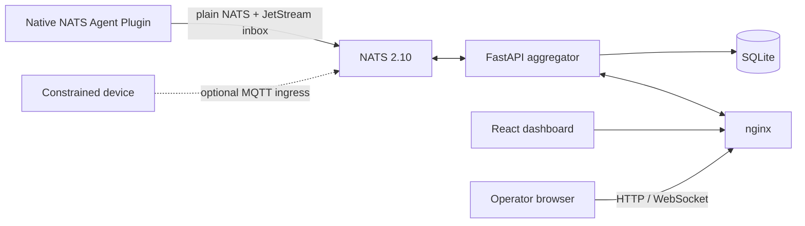

# EdgeCitadel

EdgeCitadel is a small control plane for running and observing AI agents on edge
hosts. NATS carries fleet traffic, the FastAPI aggregator stores the dashboard
view in SQLite, and the React dashboard exposes the operator interface.

The maintained transport is native NATS. MQTT ingress is an optional deployment
adapter for constrained devices and is disabled by default.

## What is included

- A NATS 2.10 server with JetStream-backed per-agent inboxes.
- A FastAPI aggregator with SQLite persistence, REST APIs, and dashboard WebSocket updates.
- A React/Vite dashboard served through nginx.
- Supervisor-managed Agent Plugins under `plugins/`.
- Playwright end-to-end tests for operator workflows.

The canonical wire contract is [`schemas/envelope.v1.json`](schemas/envelope.v1.json).

## Homebrew distribution

Homebrew is the selected installation path for both Core and Edge nodes. The
checked-in Formula has passed a real local Cellar install, `brew test`, isolated
Core initialization, Edge enrollment, plugin startup, and command/result proof.
There is no public tag or tap yet, so `brew install edgecitadel` must not be
advertised until the release is explicitly published.

Once the tap exists, the user experience is:

```bash
brew tap zhonghaozhan/edgecitadel
brew install edgecitadel

# Core only: requires Docker Desktop/Engine
edgecitadel create

# Edge: does not require Docker
edgecitadel join 'ecjoin://...'
# Or keep same-host agent messaging available during a Core outage
edgecitadel join 'ecjoin://...' --messaging-mode nats_leaf
edgecitadel plugin install echo
```

Homebrew installs read-only assets in the Cellar. Secrets, node state, plugins,
logs, SQLite, and JetStream data live under `~/.edgecitadel` and survive formula
upgrades. See [`deploy/homebrew/README.md`](deploy/homebrew/README.md).

## Source checkout

Until the first Homebrew release is published, contributors can run the same CLI
from a checkout. A Core needs Docker Engine with Compose and available ports 80,
4222, and 8222.

```bash
git clone https://github.com/zhonghaozhan/EdgeCitadel.git
cd EdgeCitadel
./scripts/edgecitadel create
```

Open <http://localhost>, or inspect readiness with:

```bash
./scripts/edgecitadel doctor
```

Runtime data is written below `data/` and `nats/data/`; neither directory should
be committed. Stop it without deleting data with `./scripts/edgecitadel down`.

## Join another Mac or Linux host

On the core, create a one-time invitation using a hostname or IP that the other
host can reach:

```bash
./scripts/edgecitadel invite --node-id studio-macmini --host 100.64.0.10
```

On the other host, clone the source checkout for this milestone and redeem the
printed invitation. Then install an Agent Plugin:

```bash
# Backward-compatible default: plugins connect directly to Core NATS
./scripts/edgecitadel join 'ecjoin://...' --messaging-mode single-client

# Local-broker topology: plugins connect to a loopback NATS Leaf
./scripts/edgecitadel join 'ecjoin://...' --messaging-mode nats_leaf
./scripts/edgecitadel plugin install ./plugins/examples/echo
```

`join` enrolls the host and stores its broker configuration; it does not claim
that an AI agent is running. `plugin install` validates and displays permissions,
prepares the Supervisor automatically, starts the Plugin process, and succeeds only
after `echo-agent` has registered, heartbeated, and become visible through the
core registry. Codex, Claude, OpenClaw, and other runtimes need their matching
Plugin package on the host where that runtime is installed.

Messaging mode is independent from the Core/Edge node role. `single-client` is
the default and starts no local broker. `nats_leaf` runs a loopback-only local
NATS/JetStream service and makes an authenticated outbound Leaf connection to
Core; agents on that one Edge can continue communicating when Core is absent,
while cross-node messaging is visibly paused. An already joined host cannot be
silently converted by rerunning `join` with a different mode.

See [`docs/onboarding.md`](docs/onboarding.md) for all modes, lifecycle commands,
security boundaries, troubleshooting, and the exact message-join sequence.

## Architecture



| Port | Owner | Purpose |
|---|---|---|
| 80 | nginx | Dashboard, `/api/*`, and `/ws/*` |
| 4222 | NATS | Native agent and service connections |
| 7422 | NATS | Authenticated inbound Leaf connections from Edge nodes |
| 8222 | NATS | Monitoring and health endpoints |
| 1883 | NATS | Optional MQTT ingress; disabled by default |

Only `agents.{id}.inbox` is a durable work queue. Registration, heartbeat,
status, logs, progress, outbox audit mirrors, and broadcasts use plain NATS.
Each inbox subject has exactly one JetStream owner: Core for Core and
`single-client` agents, or the destination Edge domain for `nats_leaf` agents.
See [`docs/architecture/multi-mode-messaging.md`](docs/architecture/multi-mode-messaging.md)
for delivery, outage, deduplication, and security semantics.
## Repository map

| Path | Responsibility |
|---|---|
| `aggregator/` | FastAPI backend, NATS subscriptions, and SQLite persistence |
| `frontend/` | The only dashboard source tree |
| `plugins/` | Installable Agent Plugin packages and runtime implementations |
| `plugin-toolkit/` | Shared Plugin runtime, validation Supervisor, schemas, and tests |
| `nats/`, `nginx/` | Local stack configuration |
| `deploy/` | Host installation and service management |
| `e2e/` | Playwright operator-flow tests |
| `plugin-toolkit/` | Plugin SDK, schemas, validation, and the auto-managed Supervisor environment |
| `plugins/` | Independently distributable plugin packages and examples |

## Development

```bash
# Backend
cd aggregator
uv run --isolated --with-requirements requirements-dev.txt python -m pytest -q

# Repository Python lint, CLI tests, and maintained strict type scopes are
# defined in .agents/skills/commit-check/SKILL.md.

# Frontend
cd ../frontend
npm ci && npm run lint && npm run build

# Deterministic end to end (owns a disposable test stack)
cd ../e2e
npm ci && npm test

# External Plugin E2E requires a separately prepared stack and Plugin services.
APP_URL=http://localhost AGG_URL=http://localhost:8000 npm run test:external-plugins
```

Repository workflow and quality gates are defined once in [`AGENTS.md`](AGENTS.md).
Tool-specific files may add integration details but do not replace those rules.
See [`CONTRIBUTING.md`](CONTRIBUTING.md) before opening a change.

## License

MIT
