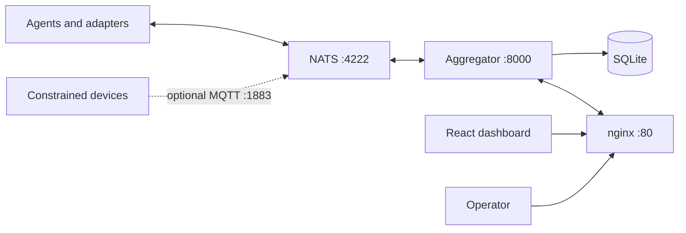

# Architecture

EdgeCitadel is a NATS-native control plane for edge agents. The development
stack has four services:

1. **NATS 2.10** routes ephemeral fleet events and owns the JetStream work queue.
2. **Aggregator** consumes fleet events, maintains the SQLite dashboard model,
   serves REST endpoints, and broadcasts WebSocket updates.
3. **Dashboard** is the compiled React application from `frontend/`.
4. **nginx** exposes the dashboard, `/api/*`, and `/ws/*` on port 80.

## Transport boundary

Native NATS is the maintained internal transport for the aggregator and agent
adapters. MQTT is an ingress compatibility option for devices that cannot speak
NATS; it is disabled by default with `EC_ENABLE_MQTT=0`. Enabling it does not
change the internal message contract.

All fleet messages use the canonical JSON envelope in
[`schemas/envelope.v1.json`](../schemas/envelope.v1.json). The base behavioral
contract is [`agent-contract.md`](agent-contract.md). Subject and JetStream
configuration belongs in [`05-messaging.md`](05-messaging.md); it is intentionally
not duplicated here.

## Persistence ownership

- JetStream stream `AGENT_INBOX` owns durable delivery to `agents.{id}.inbox`.
- Plain NATS carries registration, heartbeat, status, logs, progress, outbox
  audit mirrors, memory request/reply, and system broadcasts.
- SQLite owns the aggregator's query model, including dashboard history and
  current agent state.
- The browser consumes aggregator APIs only; it does not connect directly to
  NATS.

## Source ownership

| Area | Owner |
|---|---|
| Backend and database | `aggregator/` |
| Dashboard source | `frontend/` |
| Agent integrations | `adapters/` |
| Browser-facing routing | `nginx/` |
| Broker configuration | `nats/` |
| Host deployment | `deploy/` |

The Docker service remains named `dashboard`; there is no separate
`dashboard/` source directory.

## Authentication and configuration

Local configuration starts from `.env.example`. `NATS_TOKEN` authenticates NATS
clients. `OPENCLAW_TOKEN` is a separately scoped browser/client credential.
Secrets and runtime data stay in untracked `.env`, `data/`, and `nats/data/`.

Host-level dependencies are declared only in `deploy/manifest.toml`. See
[`02-server-setup-linux.md`](02-server-setup-linux.md) for production deployment.

## Design decisions

Accepted architectural choices live in [`adr/`](adr/). Operational documents
describe the current system; ADRs retain the rationale behind it.
