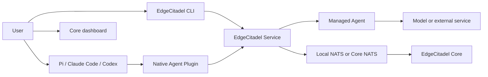
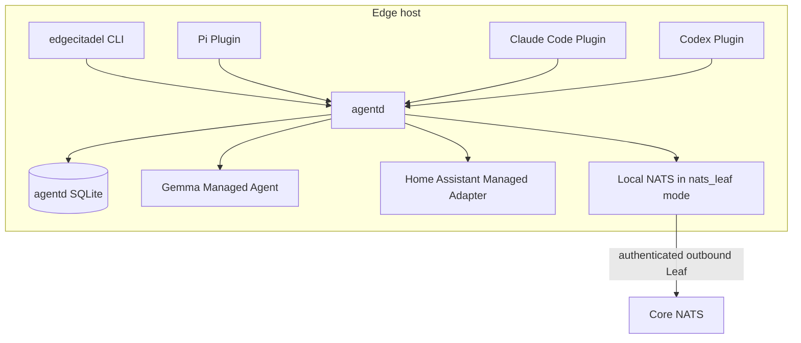

# Managed Agents and Native Agent Plugins architecture

Status: Implemented; repository verification complete, external native-host acceptance pending
Owner: EdgeCitadel maintainers
Date: 2026-09-02

## 1. Executive mental model

EdgeCitadel supports two agent integration models that share one messaging
and task protocol. A **Managed Agent** is a complete long-running runtime whose
installation, process lifecycle, dependencies, health, and task loop are owned
by EdgeCitadel; Gemma and the Home Assistant adapter use this model. A **Native
Agent Plugin** extends an existing agent host such as Pi, Claude Code, or Codex;
the host continues to own its model, session, tools, permissions, and execution
loop. Both models communicate through one host-local EdgeCitadel Service, which
owns identity, NATS connectivity, durable task state, local observability, and
recovery. Watchdog behavior becomes internal health and task reconciliation,
not a separately registered Agent.

## 2. Decision and status

### Implemented direction

- **Implemented:** The two public integration types are exactly **Managed Agent**
  and **Native Agent Plugin**.
- **Implemented:** `plugin` no longer describes an independently supervised
  Agent Runtime in user-facing CLI or documentation.
- **Implemented:** Gemma is a Managed Agent with a model-backed execution
  harness.
- **Implemented:** Home Assistant is a Managed Agent backed by a service
  adapter. It shares the deployment model with Gemma but does not pretend to own
  Home Assistant itself.
- **Implemented:** Pi, Claude Code, and Codex integrate through their native package,
  skill, hook, and MCP mechanisms.
- **Implemented:** One EdgeCitadel Service, `agentd`,
  serves both integration models.
- **Implemented:** Local SQLite stores task orchestration state, presence history,
  diagnostic events, and trace metadata. It is not itself a monitor and is not
  written directly by Agent processes.
- **Implemented:** The Watchdog Agent was removed after its useful task and
  health behavior has moved into `agentd` and replacement tests pass.
- **Implemented:** Native Agent Plugins are active-session integrations in this
  release. They do not silently start Pi, Claude Code, or Codex in the background.

### Superseded pre-migration baseline

- `edgecitadel join` already supports `single-client` and `nats_leaf` messaging.
- `nats_leaf` gives supervised processes only a loopback NATS client endpoint and
  keeps Leaf credentials outside their environment.
- `plugins/` contained Gemma, Hermes, Home Assistant, Shell, Watchdog, and
  examples as `AgentPlugin` packages.
- `plugin-toolkit/` combined static package validation, a shared Python Agent
  runtime, SDK protocols, Supervisor support, and tests.
- The root CLI exposed `edgecitadel plugin install|list|status|start|stop|logs|
  remove` and a group-level Supervisor lifecycle.
- Watchdog registered as `watchdog-1`, had no invokable skill, and synthesized
  recipient-offline results from heartbeat state.
- The Aggregator already persists global registry and observed message state in
  Core SQLite; this is distinct from the implemented Edge-local agentd store.
- Individual managed runtimes had durable outcome handling that protects
  effect execution. That effect-level idempotency must not be discarded merely
  because `agentd` gains an orchestration database.

### Open product decisions

These do not block the first implementation unless code evidence shows otherwise:

- Whether a later release may explicitly opt into headless invocation of a native
  Agent host. The first release must remain active-session only.
- Whether Hermes should ultimately be a Native Agent Plugin, an external connector,
  or a Managed Agent. Classify it from its actual lifecycle before changing it.
- Whether Home Assistant should later gain a HACS-native integration. The current
  out-of-process adapter remains a Managed Agent until that exists.
- Whether the internal `plugin-toolkit/` directory and Python package names should
  be physically renamed in this increment. Public terminology must be corrected;
  internal renames should occur only when they reduce rather than multiply migration
  risk.

### Implementation snapshot

- `edgecitadel_agentd` provides a versioned, bounded newline-JSON API over a
  private Unix socket. Native connectors authenticate with hashed per-connector
  tokens; local management operations require a distinct `admin.token`;
  Managed Agents use separate credentials and neither integration path receives
  NATS or Leaf credentials through the connector protocol.
- agentd is the only NATS client for the new integration paths. It validates all
  inbound and outbound envelopes, owns exact durable inbox consumers, writes a
  stable message-ID outbox before publication, and persists a task before ACK.
- agentd is the only writer of `agentd.sqlite3`. Operational task payloads,
  results, and pending transport envelopes are encrypted with a private local
  key; events and spans reject sensitive fields and retain metadata for 30 days.
- Installed macOS deployments run agentd as a private per-user LaunchAgent;
  installed Linux deployments with systemd use an enabled user unit. Source
  deployments and systems without either manager use a detached user process
  that does not survive a host reboot. No mode requires a root service.
- Managed Agent desired state and private launch descriptions are durable.
  agentd starts, stops, adopts, and crash-recovers owned process groups; the CLI
  only records user intent and waits for the local session lease. Restart uses
  bounded exponential backoff, stops after eight consecutive failures, and
  requires an explicit stop/start after correction.
- Gemma and Home Assistant now call the Managed Agent runtime. Pi, Claude Code,
  and Codex use their native extension/plugin mechanisms and a common MCP bridge.
- Watchdog has been removed after deadline, session-loss, presence, advisory,
  and Core max-delivery reconciliation moved to authoritative owners.
- Legacy `AgentPlugin` records remain readable and continue on the compatibility
  runtime. `plugins.json` remains a rollback artifact after atomic normalization
  to `managed-agents.json`; conversion of an installed legacy runtime requires
  installing its current Managed Agent package rather than changing semantics
  silently.

## 3. Problem and evidence

The current product asks users to install an EdgeCitadel `plugin`, but that package
is copied into a Supervisor-owned store, receives a private Python environment,
starts as a new background process, publishes its own Agent Card and heartbeat,
and consumes a durable task inbox. This is a complete Agent deployment boundary,
not the extension model users expect from Pi, Claude Code, or Codex.

The overloaded term causes three product problems:

1. A user cannot tell whether `plugin install` adds capability to an existing
   Agent or creates another Agent process.
2. EdgeCitadel duplicates an Agent host when the target product already owns the
   model, session, tool loop, and permission boundary.
3. Infrastructure behavior such as Watchdog is exposed as an Agent despite having
   no user-invokable capability.

The implementation should retain the reliable out-of-process runtime model where
EdgeCitadel genuinely owns an Agent, while adding thin native extensions where an
Agent host already exists.

## 4. Goals

1. Present two unambiguous installation paths:
   - install an EdgeCitadel-managed Agent;
   - connect an existing native Agent.
2. Preserve the current `single-client` and `nats_leaf` data plane and its tested
   offline semantics.
3. Introduce one local service boundary shared by Managed Agents and Native Agent
   Plugins.
4. Make Gemma and Home Assistant first-class Managed Agents before removing their
   old `AgentPlugin` presentation.
5. Provide useful native integrations for Pi, Claude Code, and local Codex using
   each host's official extension mechanism.
6. Replace the Watchdog Agent with internal presence, deadline, routing, and health
   reconciliation.
7. Persist local trace and diagnostic metadata in a privacy-aware SQLite store.
8. Preserve task correlation, durable inbox behavior, retry safety, duplicate
   suppression, crash recovery, and upgrade-safe state.
9. Simplify the root README around installation, Core/Edge setup, Managed Agents,
   and connecting existing Agents.
10. Remove obsolete code only after replacement behavior and migration tests pass.

## 5. Non-goals

- Automatically starting Codex, Claude Code, or Pi for an inbound task.
- Claiming a native Agent is available when its host session is closed.
- Replacing NATS with SQLite, MCP, direct HTTP, or peer-to-peer transport.
- Letting Native Agent Plugins connect directly to NATS or open the shared SQLite
  database.
- Storing prompts, model responses, tool arguments, file contents, or secrets by
  default.
- Implementing a full OpenTelemetry Collector deployment unless measurements show
  it is necessary.
- Implementing a HACS Home Assistant integration in this increment.
- Providing Codex Cloud access to a machine-local socket without a separately
  authenticated remote access design.
- Renaming `single-client` or `nats_leaf`.
- Publishing packages, pushing branches, creating a release, or creating a pull
  request without explicit authorization.

## 6. Product vocabulary and package taxonomy

| Term | Meaning | Examples | Lifecycle owner |
|---|---|---|---|
| Node | A Core or Edge host enrolled into a fleet | Core, Mac mini Edge | EdgeCitadel CLI/service |
| Managed Agent | Complete Agent endpoint run by EdgeCitadel | Gemma | `agentd` |
| Managed Adapter | Managed Agent whose work delegates to an external service | Home Assistant | `agentd` owns adapter; HA owns HA server |
| Native Agent Plugin | Extension installed into an existing Agent host | Pi, Claude Code, Codex | Native host |
| EdgeCitadel Service | Host-local control, state, transport, and observability service | `agentd` | OS user service |
| Connector protocol | Local contract between an Agent integration and `agentd` | session/task/trace API | `agentd` schema |
| Agent Card | Network-visible identity and capabilities | Gemma or active Codex session | `agentd` publishes from registered data |

Avoid these ambiguous public phrases:

- `Agent Plugin` for a Managed Agent;
- `Watchdog Agent` for infrastructure reconciliation;
- `offline mode` when only same-host messaging remains available;
- `native Agent` for Gemma merely because it is bundled by EdgeCitadel.

## 7. Target architecture

### 7.1 System context



### 7.2 Edge deployment units



In `single-client`, `agentd` connects to Core NATS directly and no local NATS
process is started. In `nats_leaf`, only `agentd` connects to the loopback Local
NATS interface. Managed Agents and Native Agent Plugins call `agentd`; neither
receives broker or Leaf credentials.

### 7.3 Responsibility contracts

| Actor | Owns | May request | Reports | Must not do |
|---|---|---|---|---|
| CLI | user intent, setup commands, readable diagnostics | `agentd` lifecycle and operations | exact outcome and recovery command | become a hidden long-running supervisor |
| `agentd` | local identity, Agent registrations, connector sessions, NATS, task orchestration, local DB, reconciliation | managed runtime operations and Core APIs | layered health, audit events, task state | execute model/domain work or expose Leaf credentials |
| Managed Agent | model/service invocation, skill implementation, effect-level outcome | local task delivery and scoped configuration | progress, result, runtime health | manage Node identity, NATS topology, or shared DB |
| Native Agent Plugin | native tools/skills/hooks, session mapping, user consent | connector API operations | session lease, capabilities, trace metadata, result | install system services silently, access NATS/Leaf secrets, write DB |
| Native host | model, conversation, tools, working directory, permissions | plugin-provided tools | session and tool lifecycle where supported | be treated as always-on after process exit |
| NATS/JetStream | routing and durable destination inbox | authenticated publish/consume | transport ACK and advisories | be the UI trace database or automatically synchronize domains |
| Core | fleet enrollment, aggregation, policy, dashboard | observed events and Agent operations | fleet state | be required for same-host `nats_leaf` work |

## 8. EdgeCitadel Service (`agentd`)

### 8.1 Service boundary

Refactor the existing host lifecycle code into one persistent user-level service.
Prefer evolving verified Supervisor and NATS lifecycle code over a ground-up
rewrite. The exact Python module path may remain temporarily compatible, but its
public role and API must become explicit.

The service must own:

- Node state loading and normalization;
- selected `single-client` or `nats_leaf` endpoint;
- NATS connection, reconnect, publish ACK handling, and subscription lifecycle;
- Managed Agent installation records and process supervision;
- Native Agent connector sessions and short-lived session leases;
- local task state and delivery reconciliation;
- Agent Card publication and presence changes;
- local event/trace persistence;
- health and diagnostic queries;
- credential redaction and revocation response.

### 8.2 Local API

Use a versioned local connector API over a Unix-domain socket on supported macOS
and Linux hosts. The socket and its parent directory must be accessible only to
the owning user. If a loopback TCP fallback is necessary, require a random local
credential stored in a 0600 file and never expose it in argv, logs, or normal CLI
output.

Required conceptual operations:

```text
GET  /v1/health
GET  /v1/agents
POST /v1/connectors/register
POST /v1/connectors/{connector_id}/sessions
PUT  /v1/connectors/{connector_id}/sessions/{session_id}/lease
DELETE /v1/connectors/{connector_id}/sessions/{session_id}
GET  /v1/connectors/{connector_id}/inbox
POST /v1/tasks
POST /v1/tasks/{task_id}/accept
POST /v1/tasks/{task_id}/progress
POST /v1/tasks/{task_id}/result
POST /v1/tasks/{task_id}/cancel
POST /v1/events
GET  /v1/traces
GET  /v1/traces/{trace_id}
```

These paths are design contracts, not a requirement to choose HTTP internally.
Define typed request/response schemas, size limits, error codes, compatibility,
timeouts, and ownership before implementation. Never place prompt or tool content
in a generic metadata field to bypass privacy rules.

### 8.3 Authentication and authorization

- A Native Agent Plugin authenticates as a locally installed connector, not as a
  NATS principal.
- A connector receives a narrowly scoped local identity and creates short-lived
  session leases.
- A Managed Agent receives only the authority needed for its declared Agent IDs
  and skills.
- `agentd` maps local identities to NATS subjects and enforces the mapping before
  publish or result submission.
- Plugin-supplied Agent IDs, task IDs, trace fields, metadata, and paths are
  untrusted input and must be validated and bounded.
- Revocation invalidates new local API calls, stops renewed session presence, and
  prevents further NATS publication without deleting audit history.
- Registration, capability reconciliation, connector listing/revocation,
  Managed Agent reconciliation, and credential reissue require the private
  local management token; a connector token cannot expand its own capabilities.
- The socket, management token, connector tokens, database, and payload key use
  private user permissions and are never put in process argv or normal output.
- This is not an OS sandbox against arbitrary code running under the same UID.
  A native Agent host with general file-read authority is a high-trust local
  principal and can potentially read that user's private state. Stronger
  same-user isolation requires a future sandbox or separate service account.

## 9. Integration model A: Managed Agents

### 9.1 Public lifecycle

The canonical interface becomes:

```bash
edgecitadel agent install gemma
edgecitadel agent install home-assistant
edgecitadel agent list
edgecitadel agent status gemma
edgecitadel agent logs gemma
edgecitadel agent start gemma
edgecitadel agent stop gemma
edgecitadel agent remove gemma
```

`edgecitadel plugin ...` must not remain the documented path. During migration it
may be a bounded compatibility alias that prints the exact replacement command.
Do not keep two independently implemented lifecycle paths.

### 9.2 Managed Agent package contract

Evolve `AgentPlugin` into a Managed Agent manifest with explicit runtime kind:

```yaml
apiVersion: edgecitadel.io/v1alpha2
kind: ManagedAgent
metadata:
  name: gemma
runtime:
  kind: model_agent
  command: [python, -m, edgecitadel_gemma_agent]
```

Home Assistant uses:

```yaml
runtime:
  kind: service_adapter
```

The schema must preserve useful package guarantees: immutable content, lock
integrity, compatibility constraints, declared dependencies, environment
allowlists, secrets, skill bindings, network/device intent, and static validation.
Do not imply OS sandbox enforcement until it exists.

### 9.3 Gemma

Gemma remains a complete EdgeCitadel-managed model Agent. Preserve:

- Ollama configuration and readiness;
- reasoning, summarization, classification, and code-explanation capabilities;
- durable inbox and correlated progress/result behavior;
- dependency isolation;
- process restart and logs;
- effect/outcome idempotency.

Its documentation must say that EdgeCitadel installs and operates the Agent
Runtime; it is not added to a pre-existing Agent application.

### 9.4 Home Assistant

Home Assistant remains a Managed Adapter that exposes bounded Agent capabilities
over an existing HA installation. Preserve:

- allowlisted entity, light, camera, and sequence behavior;
- token-file handling and redaction;
- bounded network access;
- clear distinction between adapter health and HA server reachability;
- safe denial of undeclared or malformed actions.

Removing the adapter must never uninstall or mutate the user's Home Assistant
installation.

### 9.5 Other current packages

Before deletion, produce a disposition table backed by imports, tests, docs, and
runtime behavior:

- **Hermes:** classify as Managed Agent, Managed Adapter, or future native
  connector. Preserve it until a replacement has parity.
- **Shell:** keep only if it has a supported product role; otherwise move the
  minimum necessary behavior to developer fixtures and remove it from onboarding.
- **Echo and placeholder:** keep as non-user-facing validation/integration
  fixtures when they provide unique coverage.
- **OpenClaw client:** retain its separate browser/session trust boundary unless a
  native connector demonstrably replaces it.
- **Watchdog:** follow the dedicated migration in section 12.

No package may be deleted merely because it looks unused. Prove reachability and
replacement, then remove code, tests, docs, bundled artifacts, and packaging
references together.

## 10. Integration model B: Native Agent Plugins

### 10.1 Common behavior

Every native integration must provide the platform-appropriate equivalent of:

- connect/register the existing Agent with local `agentd`;
- advertise mapped capabilities without claiming unavailable ones;
- discover available EdgeCitadel Agents;
- delegate a task with correlation and deadline;
- view inbox and task status;
- accept or reject an inbound task in an active session;
- submit progress, result, failure, and cancellation;
- query local trace and diagnostics;
- renew an active-session lease and close it on clean shutdown;
- degrade clearly when `agentd`, Local NATS, Leaf, or Core is unavailable.

The implemented discovery view merges local connector state with the latest
validated NATS presence. A disconnected transport returns remote observations as
cached evidence and does not claim live fleet-registry freshness.

Suggested user-facing skills/tools:

```text
edgecitadel-connect
edgecitadel-agents
edgecitadel-delegate
edgecitadel-inbox
edgecitadel-task-status
edgecitadel-trace
edgecitadel-diagnose
```

Do not implement continuous monitoring as an LLM skill. `agentd` monitors and
persists; a skill queries and explains that state.

### 10.2 Session availability contract

Native Agent presence is lease-based:

1. Plugin activation creates a session with host type, connector version,
   capability set, and a non-secret opaque session ID.
2. The plugin renews a bounded lease while the native session is active.
3. A clean shutdown closes the session immediately.
4. Missing renewal expires the session and changes the Agent to unavailable.
5. `agentd` may retain pending tasks according to deadline and inbox policy, but
   must not report them as delivered to the native host.
6. On the next session, the plugin lists pending tasks and requires host-supported
   or user-approved acceptance.

Do not use background heartbeats to imply that a closed native Agent can execute.

### 10.3 Pi plugin

Build a native Pi package using Pi's supported extension and skill packaging.
The extension talks only to the local connector API. It should register tools,
surface pending work, map supported lifecycle events, and package the EdgeCitadel
skills. Treat its broad local process authority as a high-trust boundary and keep
all fleet/Leaf secrets out of it.

### 10.4 Claude Code plugin

Build a Claude Code Plugin using supported skills, hooks, and MCP configuration.
Use hooks for available session/tool lifecycle signals and MCP for explicit
EdgeCitadel operations. Do not depend on Claude Code's background monitor for
durable presence or tracing: it is session-scoped and must remain an optional UI
aid at most.

### 10.5 Codex plugin

Build a Codex Plugin with a valid `.codex-plugin/plugin.json`, packaged skills,
and a local MCP server or command that talks to `agentd`. Support local Codex in
this phase. Fail clearly in environments that cannot reach the machine-local
service; do not expose `agentd` publicly or promise Codex Cloud support.

### 10.6 Shared and platform-specific code

Share only stable contracts:

- connector API schemas and generated/static types;
- task and trace identifiers;
- redaction rules;
- conformance fixtures;
- wording and source content for portable skills where semantics match.

Keep host adapters thin and separate because activation, hooks, manifests,
permissions, and installation differ. Do not force a lowest-common-denominator
abstraction over platform-specific lifecycle behavior.

## 11. Local state and observability

### 11.1 Ownership

`agentd` is the only writer of its SQLite database. Use WAL mode, bounded busy
timeouts, transactional migrations, foreign keys, and an explicit schema version.
Store the database under the EdgeCitadel state directory, outside a Homebrew
Cellar or Python environment. Database files and containing directories must be
private to the user.

### 11.2 Minimum schema

The implementation may normalize further, but must represent these concepts:

| Record | Purpose | Authoritative owner |
|---|---|---|
| `managed_agents` | install and desired lifecycle | `agentd` |
| `connectors` | native/managed local identities and versions | `agentd` |
| `sessions` | active native Agent leases | `agentd` |
| `tasks` | logical task, sender, recipient, deadline, terminal state | task state machine |
| `task_attempts` | delivery attempts, ACK evidence, retry/error | `agentd` |
| `events` | bounded diagnostic/audit events | `agentd` |
| `spans` | trace/span relationships and timing | `agentd` collector |
| `presence_history` | online/unavailable/degraded transitions | `agentd` |

Do not centralize a Managed Agent's effect-level transaction record unless the
new protocol can preserve the atomic boundary between an external side effect
and outcome persistence. The existing runtime outcome store may remain the
effect-idempotency authority while `agentd` owns orchestration history.

### 11.3 Trace model

Use OpenTelemetry-compatible concepts without binding the repository to unstable
agent-specific semantic conventions:

- `trace_id`, `span_id`, and optional `parent_span_id`;
- task, attempt, Agent, connector, Node, and session IDs;
- operation name, start/end times, status, error class;
- selected bounded attributes;
- correlation/causation IDs propagated through NATS envelopes.

Default storage is metadata-only. Prompt text, output content, tool arguments,
files, environment values, and credentials require explicit opt-in, documented
redaction, size limits, and retention. Tests must seed recognizable secret
canaries and prove they never appear in SQLite, logs, JSON status, or error output.

### 11.4 Retention and export

- The implemented default retains metadata for at most 30 days and caps events
  and spans at 50,000 records each and presence history at 10,000 records.
- Cleanup removes at most 1,000 over-limit records per table per reconciliation
  pass so it does not turn into an unbounded message-delivery transaction.
- Export optional summaries or trace records to Core asynchronously.
- Core unavailability must not block local task processing or local trace queries.
- Export retries require stable event IDs and idempotent Core ingestion.
- A user must be able to inspect storage use and delete local telemetry without
  deleting Node identity or pending tasks.

`agentd` health reports SQLite/WAL bytes and per-table telemetry counts. The
record limits bound live logical content; SQLite may retain free pages for reuse
instead of immediately shrinking the database file.

## 12. Watchdog decommissioning

Inventory every Watchdog responsibility and move it to an authoritative owner:

| Current behavior | New owner | Required outcome |
|---|---|---|
| observe heartbeat/register | `agentd` presence evaluator | durable presence transition |
| detect stale Agent | session/managed-runtime lease evaluator | unavailable status with evidence |
| observe JetStream advisory | transport health component | diagnostic event and health state |
| synthesize recipient-offline result | task reconciler | authoritative `undeliverable` or `expired` transition |
| register `watchdog-1` Agent Card | none | remove fake Agent identity |
| Watchdog logs | local event/trace store | queryable diagnostics |

The task reconciler must not impersonate the recipient. Define terminal task
states such as `completed`, `failed`, `cancelled`, `expired`, and `undeliverable`
with an explicit transition owner. If protocol compatibility requires emitting a
terminal result envelope, its sender must be a clearly defined system identity or
the authoritative task service, never the unavailable recipient.

Deletion gate:

1. Replacement unit tests pass.
2. Real-NATS offline/expiry scenarios pass.
3. Dashboard and CLI no longer rely on `watchdog-1`.
4. Migration removes or ignores stale Watchdog install records safely.
5. Packaging, docs, tests, registry seeding, and Agent lists contain no Watchdog
   as an Agent.
6. Only then remove `plugins/watchdog` and its dedicated integration suite.

## 13. Task state machine and delivery semantics

Use one logical task ID and distinct attempt IDs. At minimum:

```text
created -> queued -> offered -> accepted -> running
   |         |         |          |          |
   +---------+---------+----------+----------+-> cancelled
             +---------+----------+----------+-> expired
                       +----------+----------+-> failed
                                  +----------+-> completed
             +-------------------------------> undeliverable
```

For every transition, document and test:

- initiating identity;
- precondition and authorization;
- durable SQLite evidence;
- NATS publish/ACK evidence where applicable;
- timeout/deadline behavior;
- allowed retry with stable logical ID;
- duplicate and late-message behavior;
- restart reconciliation;
- user-visible status.

Required rules:

- Transport ACK is not Agent acceptance.
- Plugin session registration is not proof that an Agent accepted a task.
- A task is `running` only after the executing runtime or native session says so.
- Terminal transitions are idempotent; conflicting terminal results are rejected
  and audited.
- Deadlines are carried end to end. Expiry does not depend on a separately running
  Watchdog Agent.
- Redelivery may create multiple attempts but must not create multiple logical
  task executions without the existing idempotency guard.
- A Native Agent session that disappears returns accepted work to the documented
  recovery policy; never silently mark it completed or permanently lose it.

## 14. Lifecycle and failure behavior

### 14.1 `agentd` lifecycle

States:

```text
unconfigured -> configuring -> stopped -> starting -> local_ready
local_ready -> connected | degraded
connected <-> degraded
local_ready|connected|degraded -> stopping -> stopped
any transitional state -> failed -> stopped|starting
```

Process PID is liveness evidence only. Readiness requires the local API, database,
state migration, and selected NATS path to be usable. In `nats_leaf`, Leaf
disconnection with healthy local operation is degraded, not failed.

### 14.2 Managed Agent lifecycle

Cover discovery, validation, approval, immutable installation, dependency setup,
activation, readiness, degradation, crash/restart, upgrade, stop, removal, and
preserved data. Never report installation complete until a fresh runtime instance
is locally ready and its intended Agent registration is observed.

`always` and `on-failure` policies use exponential delays capped at 30 seconds.
After eight consecutive failed restarts, the runtime remains failed until the
operator corrects the cause and explicitly stops/starts it. Sixty seconds of
stable runtime clears the consecutive-failure count.

### 14.3 Native Plugin lifecycle

Cover package discovery, install validation, connector registration, session
activation, lease renewal, host shutdown, plugin upgrade, revoked connector,
`agentd` restart, and plugin removal. A native host remains usable when
EdgeCitadel is unavailable; only EdgeCitadel capabilities degrade.

### 14.4 Critical failure cases

| Failure | Required behavior |
|---|---|
| `agentd` stopped | Native host still works; plugin reports EdgeCitadel unavailable; managed Agents are not falsely healthy |
| SQLite locked/corrupt | fail affected state changes safely, retain diagnostics, provide backup/recovery command |
| Local NATS stopped | local and cross-node messaging unavailable; local API remains diagnostic |
| Leaf/Core disconnected | same-host `nats_leaf` work continues; cross-node state is visibly paused/failed per existing semantics |
| Managed Agent crashes | bounded restart policy; accepted work follows redelivery/idempotency rules |
| Native session closes | lease closes/expires; pending work remains queued until deadline or next session |
| Duplicate result | retain first legal terminal state; reject/audit conflict |
| Revoked connector | deny operations and lease renewal; preserve history |
| Upgrade interrupted | atomic state/schema transition or restart-safe rollback |
| Uninstall | stop owned services; preserve user data unless explicit purge; never remove HA or external models |

The recoverable local state unit is the complete private `agentd` directory.
In particular, `agentd.sqlite3`, `payload.key`, and `admin.token` must be backed
up and restored together with permissions preserved. Restoring the database
without its matching payload key is rejected rather than silently replacing the
key and making encrypted task content unreadable.

## 15. CLI and user experience

### 15.1 Required public commands

Retain Node and messaging commands. Add or converge on:

```text
edgecitadel service status|start|stop|restart
edgecitadel agent install|list|status|start|stop|logs|remove
edgecitadel connector list|status|revoke
edgecitadel task list|show|cancel
edgecitadel trace list|show|purge
```

Do not expose platform-native Plugin installation as if EdgeCitadel owns it.
Instead, documentation and `edgecitadel connector` diagnostics show the official
host-specific installation command.

### 15.2 Root README information architecture

Keep the root README concise and user-oriented:

1. one-paragraph product description;
2. install EdgeCitadel with pip or Homebrew;
3. create a Core or join an Edge;
4. **Install a Managed Agent** with Gemma and Home Assistant links;
5. **Connect an existing Agent** with Pi, Claude Code, and Codex links;
6. verify with `status`/`doctor`;
7. upgrade/uninstall while preserving data.

Do not put Echo, placeholder, framework rationale, contributor virtualenv setup,
unpublished-release caveats, or fixed-port exposition in the primary user path.
Developer examples belong in contributor documentation.

## 16. Migration and compatibility

### 16.1 State migration

- Version current Plugin install records before changing their meaning.
- Read existing Gemma/Home Assistant records and normalize them to Managed Agent
  records without rotating Node identity or broker credentials.
- Preserve desired enabled/stopped state, install time, version, data paths, logs,
  and runtime outcome databases.
- Write migrations atomically and make them safe to rerun after interruption.
- Keep a pre-migration backup or reversible representation until the new service
  has completed readiness once.
- Detect a conflicting partial migration and stop with an exact recovery command.

### 16.2 CLI compatibility

If users may already rely on `edgecitadel plugin`, provide a time-bounded alias:

```text
plugin install gemma -> agent install gemma
plugin list          -> agent list
```

The alias must call the same implementation and print a deprecation message. Do
not retain the alias if evidence confirms no released or supported installation
uses it; record that repository-level decision in the design and changelog.

### 16.3 Mixed versions

- Older Managed Agent processes must continue to use the current NATS envelope
  during staged migration.
- Connector API clients must send a protocol version and receive an explicit
  incompatibility response.
- Database migrations occur before accepting connector or task mutation calls.
- Core must tolerate the absence of Watchdog and understand system-owned terminal
  task states before Watchdog is removed.

### 16.4 Rollback

- Roll back code without rolling back a successfully migrated SQLite schema unless
  the older code can read it.
- Prefer additive schema changes through the compatibility window.
- Keep old package records readable until replacement behavior is verified.
- Never delete Managed Agent data during rollback.
- Native Plugin removal unregisters its connector/session but preserves task/audit
  history according to retention policy.
- A failed Managed Agent install or upgrade restores the prior record atomically,
  restarts the prior version when it was previously enabled, revokes newly
  created connector authority, and removes only the new runtime artifacts.
- A successful upgrade retains the older immutable package so the operator can
  explicitly install that package path as a version rollback.

## 17. Security boundaries

- Keep Node, NATS client, Leaf, Managed Agent, and Native connector credentials
  distinct.
- Native Plugin processes must never receive NATS or Leaf credentials.
- Managed Agents receive only local runtime authority for declared identities.
- Socket/database/config/secret paths must be private and outside package-manager
  immutable roots.
- Validate package manifests and native connector payloads as untrusted input.
- Preserve current path traversal, symlink, duplicate-key, structured-size, lock,
  and schema defenses where still applicable.
- Do not claim manifest permission declarations are enforced as an OS sandbox.
- Do not claim file modes isolate native hosts running as the same OS user;
  protocol capability enforcement and same-user filesystem isolation are
  distinct security boundaries.
- Audit connector registration, capability changes, task acceptance, terminal
  results, revocation, Managed Agent install/upgrade/removal, and trace deletion.
- Never log bearer tokens, invitation secrets, HA tokens, prompts, tool inputs,
  environment dumps, or complete connector payloads.
- An inbound native task requires explicit supported host behavior and user policy;
  remote input must not bypass the host's own permission checks.

## 18. Phased implementation plan

### Phase 0: Baseline, design, and inventory

1. Inspect all nested repository instructions and the complete working tree.
2. Trace current CLI, Supervisor, runtime, manifest, NATS, Watchdog, Aggregator,
   packaging, and test behavior.
3. Build a disposition matrix for every current package and legacy client.
4. Confirm current official Pi, Claude Code, Codex, MCP, SQLite, and NATS extension
   contracts from primary sources.
5. Update this design when evidence contradicts an assumption. Label implemented,
   proposed, assumed, and open behavior.
6. Define connector API and task-state schemas before broad implementation.

Gate: maintainers can review exact ownership, migration, deletion order, and native
host capability differences without consulting code archaeology.

### Phase 1: Establish `agentd` and local state

1. Extract/refactor current host-local lifecycle into a persistent service.
2. Implement private local API, readiness, version negotiation, and redaction.
3. Add versioned SQLite schema and transactional migration framework.
4. Move Node-selected NATS connection ownership behind `agentd` while preserving
   both messaging modes.
5. Add service, task, connector, and trace CLI queries.
6. Implement pip and Homebrew user-service lifecycle without putting mutable data
   in a virtualenv or Cellar.

Gate: a test connector can register, create/renew/close a session, send and receive
a task through real NATS, persist/query trace metadata, survive `agentd` restart,
and expose no NATS credentials.

### Phase 2: Managed Agent model and migration

1. Add Managed Agent manifest/schema and shared validator support.
2. Add canonical `edgecitadel agent` lifecycle backed by `agentd`.
3. Convert Gemma without capability or reliability regression.
4. Convert Home Assistant as `service_adapter` without changing HA ownership.
5. Migrate existing install state and retain runtime data.
6. Move Echo/placeholder to explicit developer fixtures.
7. Classify Hermes, Shell, and OpenClaw; change only with replacement evidence.
8. Remove Managed Agent wording from public Plugin instructions.

Gate: fresh and migrated Gemma/Home Assistant installs pass lifecycle, task,
restart, upgrade, secret, and uninstall tests in both messaging modes.

### Phase 3: Internal reconciliation and Watchdog replacement

1. Implement presence leases for managed and native sessions.
2. Implement authoritative task deadline/undeliverable reconciliation.
3. Persist health transitions and transport advisories locally.
4. Update Core, API, and frontend assumptions so Watchdog is not an Agent.
5. Prove offline, reconnect, late result, duplicate result, and restart behavior.
6. Remove Watchdog package and all stale registry/package references only after
   deletion gates pass.

Gate: no Watchdog process is required for correct task terminal state, presence,
diagnostics, or UI behavior.

### Phase 4: Reference Native Agent Plugin

Implement Pi first as the reference because its package combines an extension and
skills in one local installation model. Use it to validate the connector API,
session leases, task consent, local tracing, and degraded UX. Do not generalize
platform-specific code prematurely.

Gate: installing the Pi package connects an active Pi session, exposes the agreed
skills/tools, delegates a correlated task, handles a pending inbound task, records
a local trace, becomes unavailable on session exit, and recovers without duplicate
execution.

### Phase 5: Claude Code and Codex Native Plugins

1. Implement Claude Code with official plugin manifest, skills, hooks, and MCP.
2. Implement local Codex with official plugin manifest, skills, and MCP.
3. Maintain a capability matrix showing exact lifecycle signals and limitations.
4. Use conformance tests for common behavior and focused tests for each host.
5. Fail clearly rather than simulating unsupported background delivery or Cloud
   connectivity.

Gate: both integrations pass package validation and active-session workflows with
the same task/identity/security contract as Pi.

### Phase 6: Cleanup, documentation, and final verification

1. Remove superseded CLI paths, code, tests, schemas, package data, and docs only
   when their compatibility/deletion gates have passed.
2. Remove stale use of `plugin` for Managed Agents in comments and user output.
3. Update README, onboarding, architecture, Managed Agent authoring, Native Plugin
   installation, Homebrew/pip lifecycle, and troubleshooting docs.
4. Update `AGENTS.md` if maintained commands, directories, or gates changed.
5. Synchronize material architecture/codebase updates to the Obsidian Vault,
   including source page, `.manifest.json`, and `log.md`.
6. Run a post-fix adversarial review of the entire diff.

Gate: no obsolete Watchdog Agent, user-facing Managed-Agent-as-Plugin wording,
machine-specific artifact, secret, abandoned migration path, or undocumented
service remains.

## 19. Verification plan

### 19.1 Static and unit gates

- inspect staged and unstaged diffs;
- Ruff check and format verification;
- strict mypy in declared environments;
- root Python tests;
- CLI tests;
- Aggregator tests;
- toolkit/runtime tests and type checks;
- connector API schema and compatibility tests;
- SQLite migration, WAL, concurrency, corruption/error, retention, and redaction
  tests;
- Managed Agent manifest/lock validation;
- Pi, Claude Code, and Codex package/manifest validation;
- frontend build and focused tests if UI is changed.

Dependencies required by tests or typing must be declared in the correct project
configuration. Do not weaken checks, add blanket ignores, or rely on undeclared
local packages.

### 19.2 Real integration gates

Test with isolated services and cleanup only resources created by the test:

1. `single-client` with one Managed Agent;
2. `nats_leaf` with one Managed Agent;
3. Gemma lifecycle and correlated task/result;
4. Home Assistant adapter with a controlled fake/test HA endpoint;
5. same-host task during Core/Leaf outage;
6. cross-node degradation according to the implemented messaging contract;
7. `agentd` crash/restart with pending and accepted tasks;
8. Managed Agent crash/restart and duplicate suppression;
9. native session activation, lease expiry, reconnect, and pending inbox;
10. task expiry without Watchdog;
11. late/conflicting result handling;
12. revoked Managed Agent and Native connector denial;
13. local database restart/migration/retention;
14. secret-canary absence from DB/log/output;
15. Homebrew upgrade and uninstall preserving state;
16. pip wheel install/upgrade/uninstall without checkout dependency;
17. `nats-server -t` for all changed NATS configs;
18. full infrastructure restart and relevant Playwright operator workflows.

### 19.3 Native host acceptance

For each Pi, Claude Code, and Codex integration prove:

- official package layout and clean installation;
- no NATS/Leaf credential available to the Plugin;
- active session registration and bounded lease;
- correct Agent Card capabilities;
- discovery and outbound delegation;
- pending inbound task UX;
- explicit accepted/running/terminal transitions;
- local trace query with default content redaction;
- understandable behavior when `agentd`, Leaf, or Core is unavailable;
- session exit makes the Agent unavailable;
- plugin removal revokes connector authority without deleting unrelated data.

If an Agent host is unavailable in CI, provide a hermetic adapter harness plus an
explicit external validation profile. Do not claim full host verification from a
manifest-only test.

### 19.4 Review loop

Perform two separate reviews:

1. **Adversarial review before fixes:** search for data loss, duplicate effects,
   false availability, permission bypass, credential leaks, unsafe migrations,
   misleading status, direct database access, undeclared dependencies, platform
   assumptions, and premature deletion.
2. **Post-fix review:** inspect the complete final diff and confirm every initial
   finding is resolved, comments/docs match behavior, generated/local artifacts
   are excluded, and temporary services are gone.

For each failure, record the exact command and evidence, diagnose the root cause,
fix it, rerun the focused check, then rerun its enclosing suite. Do not dismiss an
unexplained failure as unrelated without proving it at the merge base.

### 19.5 Verified implementation evidence

The final repository verification on 2026-09-02 produced this evidence:

- changed Python sources pass Ruff check and format verification; the SDK's
  seven files and agentd's ten files pass strict mypy in the declared Python
  3.12 test/type environment;
- the root suite passes with 838 tests and 37 platform/opt-in skips, the
  Aggregator suite passes with 136 tests and five skips, and the complete
  Plugin Toolkit suite passes with 569 tests and three skips;
- owned real-NATS tests pass for agentd connector round trips, Core
  max-delivery reconciliation, exact destination stream ownership, Leaf
  disconnect/reconnect, duplicate suppression, local NATS restart, wrong Leaf
  credentials, and credential rotation/revocation;
- the isolated E2E environment passes 22 stack-lifecycle unit tests and all 13
  Playwright workflows, including system-owned presence reconciliation, then
  removes its owned services and credentials;
- the frontend dependency audit, lint, and production build pass; the pip wheel
  contains Core deployment sources, schemas, agentd, Managed Agents, and Native
  Agent Plugin bundles, installs without checkout dependency, and uninstalls
  without removing mutable state; Homebrew style and strict tap audit pass;
- Core and Edge NATS configurations pass `nats-server -t`, and a full Compose
  restart plus live health and operator checks pass.

Pi is additionally type-checked, packed, and dependency-audited; Claude Code
and Codex package layouts and skills pass their native validators, and Codex was
installed into an isolated local plugin directory. These are package and
hermetic connector proofs, not claims that a real interactive Pi, Claude Code,
or Codex user session was exercised. That external acceptance profile remains a
release qualification step.

## 20. Completion criteria

The architecture migration is complete only when all applicable items are true:

1. Product and code clearly distinguish Managed Agents from Native Agent Plugins.
2. Gemma installs and runs as a Managed Agent.
3. Home Assistant installs and runs as a Managed Adapter without assuming ownership
   of the HA server.
4. `edgecitadel agent` is the canonical Managed Agent lifecycle.
5. A persistent local `agentd` owns connector sessions, NATS access, task state,
   local observability, and reconciliation.
6. Native Plugins never receive NATS or Leaf credentials and never write the
   shared SQLite database directly.
7. Pi, Claude Code, and local Codex integrations provide their documented
   active-session capabilities through official extension mechanisms.
8. Closed native sessions are unavailable and pending work follows an explicit,
   tested policy.
9. Watchdog is no longer installed, registered, displayed, or required as an Agent.
10. Presence, expiry, undeliverable state, advisories, and diagnostics work without
    Watchdog.
11. SQLite trace/task state survives restart, is bounded, and excludes sensitive
    content by default.
12. Effect-level idempotency and reconnect behavior prevent duplicate logical
    execution.
13. Existing `single-client` and `nats_leaf` behavior remains correct.
14. Old install state migrates atomically without losing identity, configuration,
    logs, outcomes, or user data.
15. Pip and Homebrew installations contain all required runtime/native-plugin
    assets and keep mutable data outside package roots.
16. README and detailed docs present the two installation paths without Echo,
    Watchdog, or contributor setup in the main user journey.
17. All applicable lint, type, unit, integration, NATS, packaging, infrastructure,
    and Playwright gates pass.
18. All code slated for deletion was converted or replaced first, and retained
    components have a documented classification.
19. No secrets, machine-specific state, test residue, or misleading comments remain.
20. The Obsidian Vault source page, manifest, and log reflect the final verified
    architecture.

## 21. Implementation constraints

- Follow repository and nested `AGENTS.md` instructions.
- Use the repository's declared dependency environments.
- Preserve unrelated user changes and avoid destructive Git operations.
- Do not use `git reset --hard`, `git clean`, destructive checkout, branch deletion,
  force push, or skipped hooks.
- Do not commit, push, publish, release, comment externally, or create a PR unless
  the user explicitly authorizes that action.
- Do not modify `.env`, committed credentials, or files under `data/`.
- Do not weaken tests to fit the implementation.
- Do not replace useful types with `Any`, add blanket type ignores, or add broad
  missing-import suppression.
- Keep each phase deployable and testable. A large rewrite that prevents comparison
  with the current implementation does not satisfy this plan.
- Every removed file and every changed public command must trace to a completed
  migration item in this document.

## 22. Primary references

- [Pi coding agent repository](https://github.com/earendil-works/pi) for the
  current extension, package, tool, skill, and session lifecycle APIs.
- [Claude Code plugins](https://code.claude.com/docs/en/plugins)
  and [hooks](https://code.claude.com/docs/en/hooks) for native
  manifest, MCP, skill, and session hook boundaries.
- [Codex plugins](https://learn.chatgpt.com/docs/plugins) for marketplace,
  manifest, skills, and MCP packaging.
- [MCP lifecycle](https://modelcontextprotocol.io/specification/2025-06-18/basic/lifecycle)
  for initialize/initialized and transport shutdown behavior.
- [SQLite WAL](https://www.sqlite.org/wal.html) and
  [transaction semantics](https://www.sqlite.org/lang_transaction.html) for the
  single-writer local persistence design.
- [NATS Leaf Nodes](https://docs.nats.io/running-a-nats-service/configuration/leafnodes),
  [JetStream domains](https://docs.nats.io/running-a-nats-service/configuration/leafnodes/jetstream_leafnodes),
  and [JetStream advisories](https://docs.nats.io/running-a-nats-service/nats_admin/monitoring/monitoring_jetstream)
  for broker topology, storage ownership, and max-delivery reconciliation.
