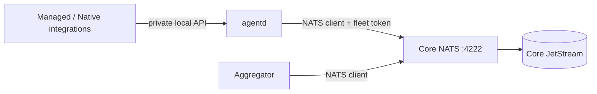
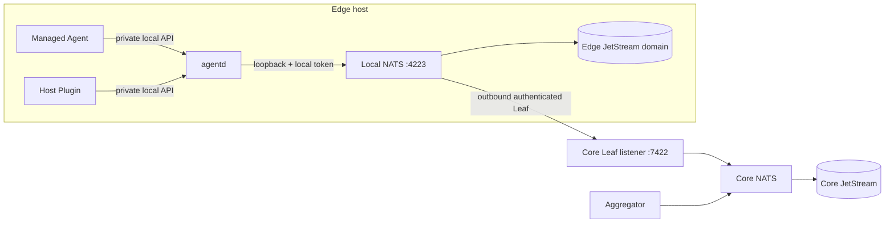
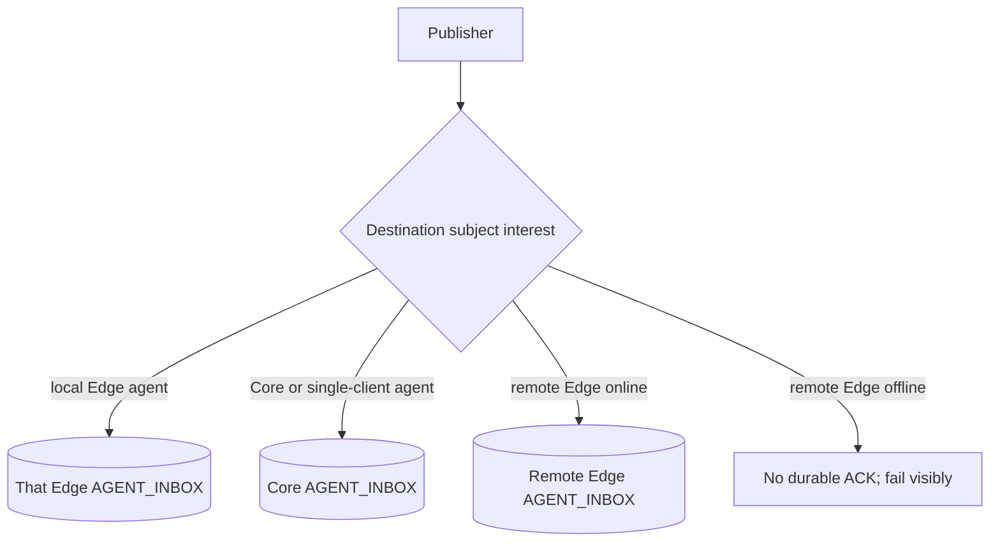

# Multi-mode messaging technical design

Status: Implemented and re-verified with agentd
Owner: EdgeCitadel maintainers
Date: 2026-08-31

## 1. Executive mental model

EdgeCitadel separates node role (`core` or `edge`) from messaging mode
(`single-client` or `nats_leaf`). In `single-client`, the host-local agentd
service connects directly to Core NATS. `nats_leaf` runs one loopback-only NATS
server on the Edge and agentd connects to it while the Leaf connects outbound
to Core. Durable inboxes are owned by the destination node, so exactly one
JetStream stores a given agent inbox subject. A disconnected Leaf preserves
same-host messaging but rejects cross-node durable publication rather than
claiming acceptance that cannot be recovered.

## 2. Decision and status

- **Implemented:** The public mode names are exactly `single-client` and
  `nats_leaf`.
- **Implemented:** Existing join commands and v1 state normalize to
  `single-client`.
- **Implemented:** Each `nats_leaf` Edge has a distinct JetStream domain and owns
  only the exact inbox subjects of agents installed on that host.
- **Implemented:** Core owns the exact inbox subjects of the Aggregator and agents
  using `single-client`; wildcard ownership is migrated away.
- **Implemented:** This increment uses one separately scoped Leaf username/password
  for the fleet. Per-node Leaf identity and per-plugin NATS accounts remain a
  security follow-up.
- **Open:** TLS for the Leaf link is required before exposure across an
  untrusted network. This increment preserves the current trusted-LAN/Tailscale
  deployment assumption and does not claim wire confidentiality without TLS.

## 3. Problem and evidence

### Historical baseline

- `join` stored v1 Edge state and gave every plugin the Core `NATS_URL` and
  fleet client token.
- Core NATS listened for clients on 4222 and had one wildcard work-queue stream,
  `AGENT_INBOX`, over `agents.*.inbox`.
- Core enrollment invitations were already expiring, hashed at rest, and single-use.
- Homebrew mutable state was already outside the Cellar, but the Formula did not
  install or supervise a host `nats-server`.

### Prototype evidence

An isolated two-server Docker prototype used distinct `CORE` and `EDGE_ONE`
JetStream domains and a real authenticated Leaf connection. With both streams
configured for `agents.*.inbox`, an Edge-origin publish produced one message in
each stream, and a Core-origin publish again produced one message in each
stream. This proves that independent domains prevent API collision but do not
prevent canonical subject double capture.

The follow-up topology uses exact destination subjects. The automated Docker
integration test now proves:

1. Edge-to-same-Edge publication is stored only on that Edge.
2. Core-to-Edge and Edge-to-Core publication is stored only at the destination.
3. A disconnected Edge still accepts its local destination subjects.
4. A disconnected Edge cannot durably publish a remote destination subject.
5. Reconnection does not copy or replay already acknowledged messages.
6. Restarting the local NATS process preserves its destination-owned messages.
7. Wrong, rotated, or revoked Leaf credentials block remote transport while the
   local destination remains usable.

This matches current NATS behavior: a Leaf is an outbound interest bridge, not
automatic storage replication; separate local JetStream requires a domain.
See the official [Leaf node topology](https://docs.nats.io/learn/topologies/leaf-nodes),
[JetStream domain](https://docs.nats.io/reference/config/jetstream/domain), and
[mirror/source](https://docs.nats.io/learn/jetstream/mirrors-and-sources)
documentation.

## 4. Goals, non-goals, and constraints

### Goals

- Preserve all current `single-client` commands and behavior.
- Make `join --messaging-mode nats_leaf` install a usable local messaging path.
- Keep same-host agent messaging available during Core or Leaf outages.
- Separate agentd client, local-client, connector, and Leaf credentials.
- Make process, local client, JetStream, Leaf, and Core health independently
  observable.
- Make state writes atomic and rollback local partial configuration on failure.

### Non-goals

- Offline communication between different Edge hosts.
- Automatic mode conversion or hardware-based selection.
- JetStream mirrors or sources in this increment.
- Full per-node accounts/JWTs, gateways, superclusters, Kubernetes, or a
  brokerless transport.
- Publishing a Homebrew tap, release, PR, or Git commit.

### Constraints

- Edge requires no Docker.
- The current envelope and `agents.<agent>.inbox` contract remains unchanged.
- Local NATS client and monitoring listeners bind to loopback.
- Mutable files live under the EdgeCitadel state directory.
- A publish is successful only after the single destination-owned stream ACKs.

## 5. Requirements and targets

| Target | Source | Design response |
|---|---|---|
| Backward-compatible default | Product requirement | Missing state field normalizes to `single-client` |
| Same-host operation without Core | Mac mini requirement | Local exact-subject stream remains authoritative |
| No duplicate destination storage | Prototype finding | One exact inbox owner; no wildcard on multiple domains |
| No silent cross-node loss | Product requirement | No destination interest means publish timeout/error |
| Loopback-only local exposure | Security requirement | `127.0.0.1` client and monitoring listeners |
| Upgrade-safe state | Homebrew requirement | Config/data/log/PID under `~/.edgecitadel/nats_leaf` |
| Deterministic recovery | Operations requirement | Explicit lifecycle state plus `messaging restart` |

No throughput, latency, RPO, or fleet-size SLO is invented here. Existing
stream limits remain 1 GiB, 1 MiB per message, 24-hour age, and a five-minute
duplicate window until measured workloads justify a change.

## 6. Architecture views

### 6.1 `single-client`



### 6.2 `nats_leaf`



### 6.3 Inbox ownership



Each stream contains exact subjects such as `agents.echo-agent.inbox`; no two
active streams may claim the same subject.

## 7. Deployment units and responsibilities

| Unit | Owns | Requests/reports | Forbidden |
|---|---|---|---|
| EdgeCitadel CLI | mode selection, state, config, and user intent | Core enrollment; agentd/local readiness | Acting as a hidden process supervisor |
| agentd | NATS client, exact inbox consumers, durable outbox, task state, connector sessions | selected broker endpoint and Core subjects | Giving broker credentials to Agent processes |
| Local NATS | local client ingress, local JetStream, outbound Leaf | `/healthz`, `/jsz`, `/leafz` on loopback | Listening publicly for clients/monitoring |
| Core NATS | Core/single-client inboxes and Leaf listener | Leaf authentication and routing | Dialing an Edge |
| Aggregator | enrollment, registry, observability, Core stream bootstrap | Core NATS | Relaying ordinary A2A payloads at application level |
| agentd Managed Agent supervisor | process lifecycle and local session recovery | durable desired state | Choosing/changing messaging mode |
| Managed/Native Agent integration | domain work and host-native tools | scoped agentd socket API | Reading NATS/Leaf credentials or editing broker config |

## 8. State and interfaces

### Node state v2

```json
{
  "version": 2,
  "mode": "edge",
  "messaging_mode": "nats_leaf",
  "core_url": "http://core.example",
  "upstream_nats_url": "nats://core.example:4222",
  "plugin_nats_url": "nats://127.0.0.1:4223",
  "plugin_nats_token": "<local-secret>",
  "jetstream_domain": "edge_<stable-id>",
  "agent_id": "studio-macmini"
}
```

- **Implemented:** v1 Core/Edge state is normalized in memory to
  `messaging_mode=single-client`; reading does not rewrite or rotate secrets.
- **Implemented:** v2 `single-client` retains legacy `nats_url`/`nats_token`
  aliases for mixed-version compatibility, but plugin environment construction
  uses the normalized broker fields.
- **Implemented:** Leaf username/password is stored only in a separate 0600 local
  credential/config file, not in plugin environment or normal CLI output.

### Enrollment

`POST /api/enrollment/redeem` accepts the requested `messaging_mode`.
`single-client` receives the existing fleet client token. `nats_leaf` receives
the separately scoped Leaf username/password only after the invitation is
redeemed. The visible `ecjoin://` payload remains v1 and never contains a
long-lived Leaf credential.

### agentd broker environment

| Mode | `NATS_URL` | `NATS_TOKEN` | `NATS_DOMAIN` |
|---|---|---|---|
| `single-client` | Core client URL | fleet client credential | unset |
| `nats_leaf` | `nats://127.0.0.1:4223` | Edge-local client credential | Edge-specific domain |

Only agentd receives these mode-selected broker values. Agents from packages receive
the private agentd socket location plus their declared configuration; Native
Agent Plugins receive a scoped connector token. Neither integration type gets
NATS or Leaf credentials. Legacy installed-package records are read-only
compatibility state: they can be inspected or stopped, but never launched.

## 9. Runtime scenarios

### Join in `single-client`

1. Parse and validate invitation and requested mode.
2. If state exists, normalize it and require the same requested mode.
3. Redeem invitation with `messaging_mode=single-client`.
4. Atomically write v2 state; no local server is configured or started.

### Join in `nats_leaf`

1. Verify `nats-server` exists, ports are available, state paths are private,
   and a placeholder config passes `nats-server -t` before redemption.
2. Redeem the invitation with `messaging_mode=nats_leaf`.
3. Write credentials/config to temporary 0600 files and validate the final
   config.
4. Persist lifecycle `configuring`, install/start the user service, and wait for
   process, client, JetStream, and Leaf readiness.
5. Atomically commit v2 node state only after readiness.
6. On failure, stop only the process created by this attempt, remove temporary
   state, preserve diagnostics, and explain that the invitation was consumed
   plus the exact recovery command.

### Local publication while disconnected

1. Publisher sends `agents.<local-agent>.inbox` through its local JetStream
   domain with stable `Nats-Msg-Id` equal to envelope ID.
2. The local exact-subject stream stores once and returns the ACK.
3. The local durable consumer processes and ACKs normally.
4. No Leaf connection is required.

### Cross-node publication while disconnected

1. Publisher sends a remote agent inbox subject through local JetStream.
2. No destination stream interest is reachable, so no stream ACK arrives.
3. Client reports timeout/service unavailable; the operation is not called
   accepted.
4. Caller may retry with the same envelope ID after connectivity returns; the
   destination duplicate window suppresses an ambiguous repeated store.

### Reconnect

1. NATS reconnects the Leaf with bounded one-second retry intervals.
2. Interest for exact destination subjects is re-advertised.
3. No mirror/source backfill occurs because none is configured.
4. Locally acknowledged messages remain local; failed remote publications are
   retried only by the application with the same message ID.

## 10. Lifecycle state machine

| State | Owner | Guard/evidence | Timeout | Recovery/status |
|---|---|---|---|---|
| `unconfigured` | CLI | no valid config | none | run `join` |
| `configuring` | CLI | durable lifecycle record; temp config | 30s | rollback temp files/process |
| `stopped` | CLI/service manager | valid config, no owned PID | none | `messaging start` |
| `starting` | CLI/service manager | start requested; owned PID expected | 20s | stop and classify `failed` |
| `local_ready` | NATS/CLI | process + client + `/jsz` ready | 20s | continue Leaf wait |
| `leaf_connected` | NATS/CLI | `/leafz` reports active remote | 20s initial | healthy |
| `degraded` | CLI observer | local ready, Leaf/Core unavailable | none | local works; remote paused |
| `stopping` | CLI/service manager | stop requested | 10s | TERM then owned-process kill |
| `failed` | CLI | config/process/local JS failure | none | `messaging restart`; inspect log |

A PID or open TCP port alone is never readiness. On restart, observed process,
local client, JetStream, and Leaf evidence overrides a stale lifecycle label.

## 11. Consistency, retries, and deduplication

- The destination stream is the authoritative acceptance point.
- Delivery remains at-least-once; consumers must be idempotent by logical
  `task_id` where side effects matter.
- Publication retries reuse envelope `id` as `Nats-Msg-Id`; the five-minute
  stream duplicate window handles ambiguous publisher ACKs.
- A stream subject ownership conflict is a configuration failure and blocks
  Agent readiness.
- Mirrors and sources are deliberately absent. Their direction is therefore
  neither Core-to-Edge nor Edge-to-Core in this increment.
- Backpressure remains `discard=new`, so a full stream rejects new durable
  acceptance.

## 12. Security and trust boundaries

- Local client and monitoring listeners bind to loopback.
- Core Leaf listener is distinct from the Core client listener.
- Core client token, Edge-local client token, invitation token, and Leaf
  username/password are separate values.
- Secret files and generated config are 0600; private directories are 0700.
- Secrets never appear in process argv, invitation payload after redemption,
  status/doctor JSON, or normal logs/output.
- **Known residual risk:** all Leaf Edges share one Leaf identity in this
  increment, so revocation is fleet-wide and a compromised Edge can authenticate
  as another Leaf. Per-node NKey/JWT credentials plus accounts and subject ACLs
  are the required follow-up.
- **Mitigated in new integrations:** agentd alone holds the node client token;
  Host Plugins use separate local Connector credentials. Legacy direct
  NATS package launch support has been removed; old records are inspect/stop-only.

## 13. Failure analysis

| Failure | Durable effect | User-visible classification | Recovery |
|---|---|---|---|
| Agent healthy, Local NATS down | local SQLite tasks remain explicit; no remote durable accepts | degraded | `messaging restart`; agentd reconnects |
| Local NATS healthy, Leaf down | local accepts continue; remote fails | degraded | automatic Leaf reconnect |
| Leaf restored, no subject interest | remote publish still fails | degraded/config error | reconcile agent stream subject |
| Duplicate publish ID | one destination store within window | healthy | return existing ACK semantics |
| Core and Edge wildcard overlap | duplicate storage | prohibited | config validation/migration blocks start |
| Revoked/wrong Leaf credential | local ready, remote denied | degraded | issue/reconcile credential and restart |
| Stale PID | no authority by itself | stopped/failed from probes | remove stale PID and start owned service |
| Upgrade | state/config preserved outside Cellar | unchanged or degraded | deterministic reconcile and restart |

## 14. Observability and operations

Stable doctor checks:

- `node_configuration`
- `core_api`
- `core_nats`
- `local_nats_process`
- `local_nats_client`
- `local_jetstream`
- `leaf_connection`
- `local_agent_messaging`
- `cross_node_messaging`

`nats_leaf` is healthy only when all local layers and the Leaf are ready. It is
degraded when local messaging is ready but the Leaf/Core is unavailable. JSON
includes `messaging_mode`, stable check IDs, boolean status, and redacted
details.

## 15. Migration, rollback, and decommissioning

1. Reading v1 state normalizes to `single-client` without writing.
2. New joins write v2 state atomically.
3. Core stream reconciliation replaces wildcard ownership with the exact
   filters of existing durable consumers plus the Aggregator subject.
4. agentd adds each active connector's exact subject before publishing presence.
5. Mixed-version packages that rely on the old wildcard but do not reconcile a
   subject are unsupported for `nats_leaf` and fail readiness visibly.
6. Mode conversion is not part of `join`; conflicting reruns fail without
   mutation.
7. Uninstall stops the managed service but preserves config/data unless an
   explicit future purge command is requested.
8. Rollback to the prior release is safe for `single-client`; a host already
   joined in `nats_leaf` must remain stopped or upgrade again because the older
   CLI cannot interpret v2 topology.

## 16. Test and proof evidence

- Implemented unit coverage: exact CLI choices/default, v1 normalization, same/conflicting join,
  atomic writes, permissions, redaction, deterministic config, endpoint/domain
  environment, lifecycle classification, Cellar separation.
- Implemented config coverage: Core and Edge `nats-server -t`, listener addresses, credential
  separation, domain/path, no placeholders.
- Implemented isolated NATS integration: Core plus two Leaf Edges, local and
  remote destinations, disconnect/reconnect, duplicate IDs, local NATS restart,
  and wrong/rotated/revoked Leaf credentials.
- The agentd migration adds real-NATS round-trip, local task, restart, session
  loss, invalid-envelope, revocation, and duplicate logical-task proofs. The
  final repository run also passes configuration validation, packaging,
  full-stack restart, and all 13 isolated Playwright workflows.

## 17. Alternatives

- **Rejected: wildcard stream on every domain.** The prototype proved double
  storage for every connected publish.
- **Rejected: automatic mirrors/sources.** They add a second durable copy and a
  reconciliation protocol without solving which side may execute a task.
- **Rejected: application relay in Aggregator.** It makes the control plane a
  data-plane availability dependency.
- **Deferred: per-Edge accounts/JWTs.** This is the stronger security endpoint
  but materially expands enrollment, resolver, rotation, and mixed-version
  migration beyond this increment.

## 18. Implemented phases and final gates

1. Implemented state/CLI/enrollment compatibility and tests.
2. Implemented Core Leaf listener, credential reconciliation, and config validation.
3. Implemented Edge config/lifecycle/status plus explicit local `nats-server`
   preflight and platform package-manager guidance for `nats_leaf` only.
4. Implemented exact-subject stream reconciliation and agentd endpoint selection.
5. Implemented isolated fault integration tests and operator UX.
6. Completed full-stack verification and evidence capture; synchronized this
   final design to the Obsidian Vault.

Implementation is complete only after each requirement in the goal has direct
test or runtime evidence; a curl-only check cannot prove the workflow.
